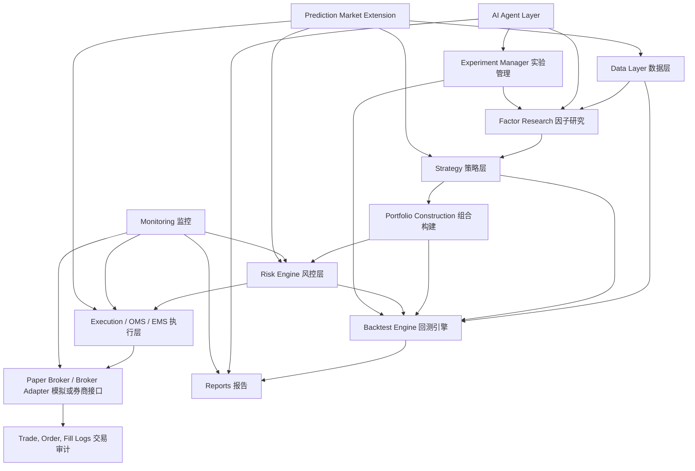
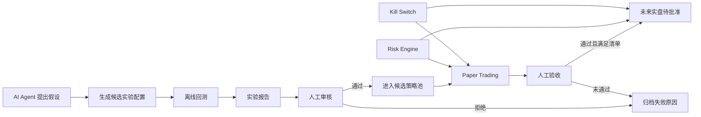
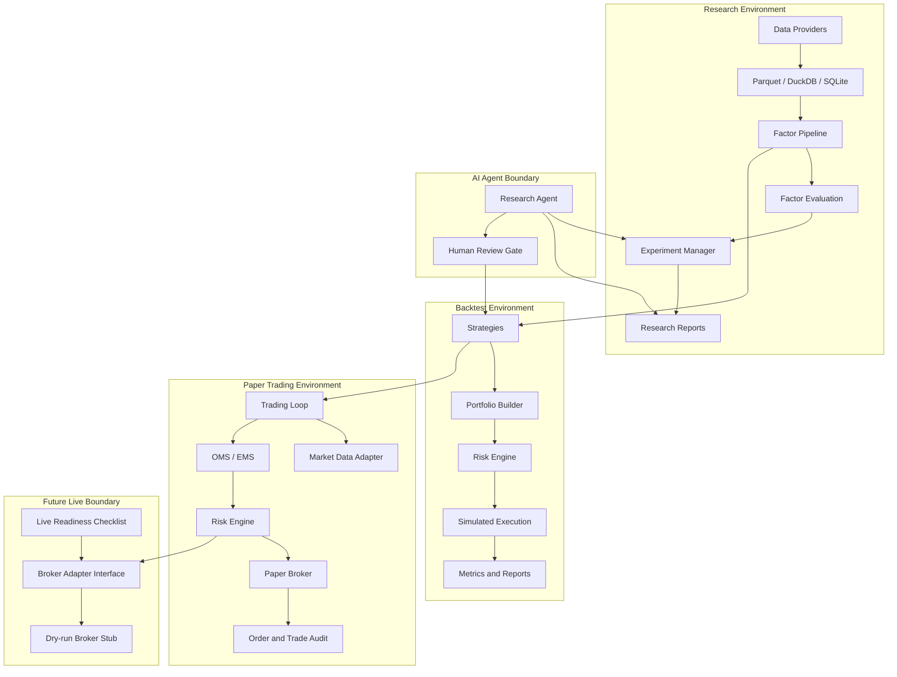

# AI 量化交易系统设计调研

生成日期：2026-04-25

本文件是正式写代码前的系统设计研究文档。它的目标不是证明某个策略能赚钱，而是确定一个可回测、可复验、可扩展、可逐步接入模拟交易和未来实盘接口的工程路线。

本项目默认先做研究、回测、模拟交易。所有实盘相关能力都必须默认关闭，且不能绕过风控、日志、审计和人工确认。

---

## 1. 完成标准

本阶段只完成研究和设计，不写系统代码。

完成标准：

- 已阅读本地 PDF：`Roan-on-X-the-Math-Needed-for-Trading-on-Polymarket-Complete-Roadmap(1).pdf`。
- 已联网核对主要框架、数据源、券商接口、Polymarket 官方文档和 AI 风险资料。
- 已明确哪些能力属于量化系统通用能力，哪些只属于 prediction market / Polymarket 扩展。
- 已给出阶段化路线，Phase 0 之前不进入实现。
- 已明确默认安全边界：`dry_run=true`、`paper_trading=true`、实盘关闭、AI Agent 不允许直接下单。

---

## 2. 从 Polymarket 文档提炼出的架构启发

用户提供的 PDF 主要讨论 prediction market / Polymarket 套利中的数学和执行问题。它不应该被直接等同于本项目的主系统，但其中有很多思想对交易工程有价值。

### 2.1 对本系统有价值的通用思想

1. **成交前必须有明确的交易条件**

   文档强调在执行前计算“最低收益保证”或“执行阈值”。映射到本系统里，不应允许策略直接下单。策略只能产生目标仓位或信号，订单必须经过：

   - 成本估算
   - 滑点估算
   - 仓位限制
   - 资金限制
   - 风控规则
   - kill switch 状态

2. **执行不是研究的附属品，而是独立系统**

   PDF 反复强调实时行情、订单簿深度、部分成交、延迟和市场变化。普通股票多因子系统虽然第一阶段可以从日线开始，但系统边界必须提前区分：

   - 研究层：生成信号和目标仓位
   - 回测层：模拟交易过程
   - 执行层：决定怎么下单
   - 风控层：决定能不能下单
   - 监控层：记录和报警

3. **实时市场需要状态管理**

   Polymarket 场景里要维护大量 market / condition / outcome / order book 状态。普通股票场景里也一样，只是对象换成 symbol / bar / quote / position / order / fill。

   因此主系统的数据模型应保留事件驱动扩展能力，而不是只写一个 dataframe 回测脚本。

4. **部分成交和多腿交易必须被系统级处理**

   Polymarket 套利常见多腿订单，一条腿成交、另一条腿没成交会产生风险。普通股票系统里也会有：

   - 组合调仓时部分订单未成交
   - 流动性不足
   - 涨跌停或停牌
   - 订单超时
   - 撤单失败

   所以 OMS / EMS 和 broker adapter 是主架构的一部分，不应该等到最后才补。

5. **大规模扫描要和交易执行解耦**

   文档提到监控上千或上万个市场。映射到本项目：

   - 因子研究可以批量跑实验
   - 策略扫描可以批量生成候选机会
   - 但进入交易执行前必须降速、验算、风控和记录

6. **优化器应作为插件，而不是写死在策略里**

   文档涉及 integer programming、Frank-Wolfe、Barrier Frank-Wolfe 等优化方法。这些不应塞进普通股票 MVP。正确做法是预留优化器接口：

   - Phase 4 可用于多因子权重合成或约束组合优化
   - Phase 8 可用于 prediction market arbitrage solver
   - 不同优化器通过统一接口接入

### 2.2 只适合 prediction market 的内容

以下内容不适合作为普通股票多因子 MVP 的核心：

- marginal polytope
- LMSR / Bregman projection
- Frank-Wolfe / Barrier Frank-Wolfe
- outcome / condition 逻辑约束
- binary outcome token settlement
- Polymarket CLOB token ID 和 condition ID 映射
- 多市场组合套利的 integer programming 求解
- resolution / settlement risk
- Polygon 链上结算相关细节

这些应放到 Phase 8 的高级扩展模块中，先做接口和数据结构，不在 Phase 1 强行实现。

### 2.3 PDF 中需要谨慎对待的内容

PDF 中关于利润规模、顶级套利账户和生产延迟的描述，需要和原始论文、链上数据或实际接口进一步核验。本文档只把它们当作系统设计启发，不把它们当成策略收益承诺。

尤其需要注意：

- 这不是投资建议。
- prediction market 有法律、地区、平台规则和结算风险。
- Polymarket 接口、SDK 包名和认证方式可能变化，接入前必须以官方文档和沙盒测试为准。
- 任何 live trading 都不能默认开启。

---

## 3. 完整量化交易系统应包含的模块

目标系统不是一个回测脚本，而是一套研究和交易工程平台。核心模块如下。



### 3.1 Data Layer

职责：

- 下载和读取 OHLCV 数据
- 缓存和版本化数据
- 清洗缺失、重复、异常值
- 校验字段、时间、价格、成交量
- 对齐交易日历和时区
- 维护 point-in-time (PIT) 语义
- 记录数据来源和下载时间
- 防止 look-ahead bias
- 支持 corporate actions
- 维护动态股票池 / universe 快照，降低 survivorship bias
- 支持 Parquet / DuckDB / SQLite / PostgreSQL 扩展

设计判断：

- Phase 1 先使用本地 CSV / Parquet 加 yfinance 或 Stooq 作为可替代数据源。
- 研究数据默认保存 Parquet，便于按 symbol/date 分区。
- DuckDB 用于本地查询和质量检查，不急着上 PostgreSQL。
- 数据表建议至少包含 `event_ts`、`knowledge_ts`（或 `effective_ts`）两类时间字段，保障 PIT 回放。
- universe 以“按日期快照”保存，不用静态成分股列表替代历史可交易范围。
- yfinance 只能作为研究和教学数据源，不能作为生产级行情源；其 README 明确说明用途偏研究和教育，实际数据使用权需看 Yahoo 条款。
- Polygon / Alpaca 更适合后续作为更稳定的数据源，但需要账号、权限和费用确认。

### 3.2 Factor Research Layer

职责：

- 因子定义、计算、版本管理
- IC / Rank IC
- 分组收益
- 衰减分析
- 因子相关性
- 去极值、标准化、中性化
- 多因子组合
- walk-forward / rolling validation
- 防止 data leakage
- 输出报告

设计判断：

- Phase 2 先自研轻量因子 pipeline，使用 pandas / numpy。
- 因子结果需要物化并版本化保存，建议最小 schema：`factor_id`、`factor_version`、`asset`、`ts`、`value`、`computed_at`。
- vectorbt 可在 Phase 2 或 Phase 4 作为高速参数扫描工具，但不作为主执行系统。
- Qlib 更适合 ML 因子研究和模型实验，后续可作为研究扩展，不应在 Phase 0 就引入。
- AI Agent 只允许提出候选因子和实验配置，不能直接把策略推到 paper/live。

### 3.3 Strategy Layer

职责：

- 单因子策略
- 多因子打分策略
- 规则策略
- 机器学习预测策略
- prediction market arbitrage 策略扩展

强制边界：

- strategy 输出 signal / target weight / target position。
- strategy 不创建真实订单。
- strategy 不访问 broker credentials。
- strategy 不修改 risk limits。
- 同一个 strategy 接口必须可在 backtest / paper / future live 复用，避免环境分叉。

### 3.4 Backtest Engine

职责：

- 组合级回测
- 多资产回测
- 交易成本
- 滑点
- 撮合逻辑
- 订单、成交、持仓、现金、权益曲线
- 再平衡
- 指标：收益、回撤、Sharpe、Sortino、Calmar、turnover、exposure、benchmark comparison

关键假设必须显式记录：

- 信号在什么时候生成
- 订单在什么时候成交
- 用 close、next open、VWAP 还是 limit 模拟成交
- 复权价格是否只用于信号，成交价格如何处理
- 手续费和滑点如何计算

执行与回放契约：

- 每条信号和订单必须记录 `signal_ts` 与 `execution_ts`。
- 回测撮合按能力分级：Phase 3 先做 L1（bar 级）；Phase 5 之后按需扩展 L2（quote 级）；Phase 8 视需要扩展 L3（order book 级）。
- 风控拒单后如何处理必须固定语义（丢弃、重试或降级），并在报告中可审计。

### 3.5 Portfolio & Risk Layer

职责：

- 目标权重计算
- 单票上限
- 行业/风格暴露限制
- 杠杆限制
- 最大回撤限制
- 最大单笔订单金额
- 最大日亏损
- 最大换手率
- allowed_symbols / blocked_symbols
- kill switch
- 交易前和交易后风控

强制规则：

- 所有订单必须先经过 risk check。
- 回测、模拟、未来实盘都使用同一套风控接口。
- AI Agent 不能修改 live 风控参数。
- 风控拒单的处理语义（drop / retry / downgrade）必须可配置，并在订单审计与回测报告中可追溯。

### 3.6 Execution Layer / OMS / EMS

职责：

- signal 到 order 的转换
- order lifecycle
- order status
- partial fill
- retry
- cancel / replace
- timeout
- execution threshold
- slippage estimate
- broker adapter
- paper trading adapter
- live trading adapter

设计判断：

- Phase 5 先实现 paper broker 和 simulated exchange。
- Phase 6 只做 adapter interface 和 stub，不直接真实下单。
- Alpaca / IBKR / crypto / Polymarket 都通过 adapter 接入，不能让策略层直接调用外部 API。
- OMS 需要显式状态机，至少覆盖 `NEW -> SENT -> PARTIALLY_FILLED -> FILLED / CANCELLED / REJECTED / EXPIRED`。

### 3.7 Monitoring & Observability

职责：

- structured logging
- experiment logging
- order logging
- trade logging
- error logging
- risk breach report
- daily report
- anomaly detection
- 未来扩展 Prometheus / Grafana / MLflow / Langfuse / OpenTelemetry

设计判断：

- Phase 0 先用本地日志和结构化 JSON/CSV。
- Phase 4 加实验数据库。
- Phase 7 如接入 AI Agent，可增加 LLM 调用日志和报告审计。

### 3.8 AI Agent Layer

AI Agent 的正确定位是研究助手和审计助手，不是自动交易员。

允许：

- 读取实验结果
- 总结策略表现
- 提出新因子假设
- 生成候选因子代码
- 生成回测配置
- 检查潜在 data leakage
- 总结失败原因
- 生成日报、周报
- 维护文档

禁止：

- 未经人工确认直接进入 live
- 未经风控直接下单
- 自动扩大仓位
- 修改 live risk limits
- 绕过 kill switch
- 持有或输出 broker credentials
- 在未经批准的环境中调用 broker SDK 或交易 API

执行约束：

- Agent 生成代码默认在隔离执行环境中运行。
- 默认禁止网络访问和外部下单权限，除非人工在受控环境中显式放行。
- Agent 所有实验建议、参数和摘要都必须落审计日志。

推荐的安全设计：



### 3.9 跨层插件接口契约（为论文思路接入预留）

本节不属于 AI Agent，独立列出仅因前序章节已覆盖各层职责，这里集中给出跨层共享接口。

为保证“新论文思路可快速接入”，主系统提前固定三类契约：

1. `Factor`：输入 `FactorContext`，输出按 `(asset, ts)` 对齐的因子值。
2. `Strategy`：输入 `StrategyContext`，输出 `target_weight` 或 `target_position`，不直接下单。
3. `PortfolioOptimizer`：输入预期收益、风险模型和约束，输出目标权重。

建议在 Phase 0 即定义抽象接口（Protocol / ABC），后续每个新论文思路优先通过插件接入，而不是改核心引擎。

最小接口示例（仅签名，Phase 0 落地时实现）：

```python
from typing import Protocol
import pandas as pd

class Factor(Protocol):
    factor_id: str
    factor_version: str
    lookback: int

    def compute(self, ctx: "FactorContext") -> pd.Series: ...
    # 返回 MultiIndex=(asset, ts) 的因子值

class Strategy(Protocol):
    strategy_id: str
    strategy_version: str

    def on_bar(self, ctx: "StrategyContext") -> list["TargetPosition"]: ...
    # 仅输出目标仓位，不下单、不调用 broker

class PortfolioOptimizer(Protocol):
    def solve(
        self,
        expected_returns: pd.Series,
        risk_model: "RiskModel",
        constraints: list["Constraint"],
    ) -> pd.Series: ...
    # 返回目标权重；不感知执行
```

---

## 4. 框架与工具调研比较

### 4.1 总体结论

推荐采用“轻量自研主干 + 可插拔外部框架”的路线。

主干：

- Research：pandas / numpy / DuckDB / Parquet 自研 pipeline
- Fast sweep：vectorbt 可选
- ML factor research：Qlib 可选
- Backtest：Phase 3 自研轻量事件驱动回测
- Paper / Future live：自研 broker adapter + OMS / EMS + risk engine
- Advanced event/live parity：后续评估 NautilusTrader
- AI Agent：只接入实验管理和报告，不接入下单权限
- Prediction market：Phase 8 独立扩展模块

补充判断：

- Phase 3 自研回测时尽量采用消息总线 + 事件对象的设计，以降低后续对接 NautilusTrader 等事件系统的迁移成本。

不建议一开始直接把整个系统建立在 Backtrader、LEAN、NautilusTrader 或 Qlib 上。原因是项目当前需要先把边界、数据、风控、实验记录和 AI 安全门做好；过早引入大框架会让学习和控制成本变高。

### 4.2 回测 / 交易框架比较

| 工具 | 初学者理解 | 多因子研究 | 事件驱动回测 | 实盘迁移 | 多资产 | 组合级回测 | 成本/滑点/成交模拟 | broker adapter 扩展 | AI Agent 自动实验 | 维护与生态风险 | 本项目判断 |
|---|---:|---:|---:|---:|---:|---:|---:|---:|---:|---|---|
| Backtrader | 高 | 中 | 高 | 中偏低 | 中 | 中 | 高 | 中 | 中 | 项目成熟但偏老，部分 live 依赖过时；GPL 许可也需注意 | 适合学习事件驱动和回测概念，不建议作为长期主干 |
| vectorbt | 中 | 高 | 低 | 低 | 高 | 中 | 中 | 低 | 高 | 活跃度和版本需持续核对；免费版与 Pro 功能边界要注意 | 适合研究层和参数扫描，不适合 OMS/EMS 主干 |
| QuantConnect LEAN | 低到中 | 中 | 高 | 高 | 高 | 高 | 高 | 高 | 中 | 生态强但工程重，C#/Docker/数据模型学习成本高 | 适合成熟团队或未来对接 LEAN 生态，Phase 0 不采用 |
| NautilusTrader | 中偏低 | 中 | 高 | 高 | 高 | 高 | 高 | 高 | 中 | 新一代生产级框架，能力强但学习成本较高 | 后续实盘级事件系统候选，不建议 MVP 一开始绑定 |
| Qlib | 中 | 高 | 中 | 中 | 中 | 高 | 中 | 中 | 高 | AI/ML 研究能力强，但数据和工作流较重 | 后续 ML 因子研究候选，Phase 2 可借鉴概念，不先引入 |
| vn.py | 中 | 中 | 高 | 高 | 高 | 中到高 | 高 | 高 | 中 | 中文生态强，偏国内期货/证券实盘和桌面应用 | 若未来重点做国内交易接口可用，当前国际股票/ETF MVP 不作为主干 |
| 自研轻量事件驱动框架 | 高 | 高 | 中到高 | 中 | 可设计为高 | 可设计为高 | 可设计为高 | 可设计为高 | 高 | 需要纪律和测试，否则容易变成不可靠脚本 | 推荐作为 Phase 0-5 主干，边做边保持边界清晰 |

### 4.3 各框架详细判断

#### Backtrader

优点：

- 事件驱动模型直观。
- 内置 broker simulation、订单类型、手续费、滑点、volume filler 等。
- 学习资料多。

缺点：

- 项目风格偏早期 Python 生态。
- README 中 live trading 依赖如 IbPy、旧 Oanda 适配等明显偏老。
- GPL-3.0 许可需要关注未来商业或闭源使用限制。
- 不适合作为 AI Agent 批量实验和多因子研究的核心平台。

结论：

- 可作为学习参考。
- 不作为本项目长期主干。

#### vectorbt

优点：

- 基于 pandas / NumPy / Numba，适合快速研究和参数扫描。
- 对多资产、多参数组合非常方便。
- 与 notebook 和图表结合好。

缺点：

- 本质偏向向量化研究，不是完整交易执行系统。
- 对复杂订单生命周期、部分成交、异步 broker adapter 不适合作为核心。
- 部分高级功能在 Pro 版本中，需确认许可和预算。

结论：

- 推荐作为 Research 层加速器。
- 不作为 Execution / OMS 主干。

#### QuantConnect LEAN

优点：

- 专业级事件驱动引擎。
- 支持多资产、实盘、brokerage、云端和本地 CLI。
- 模型和数据概念完整。

缺点：

- 工程体量大，学习成本高。
- 本地运行通常涉及 Docker、.NET、LEAN 数据格式。
- 若项目目标是从零构建自己的 AI 研究和执行系统，直接采用 LEAN 会遮蔽很多核心工程能力。

结论：

- 未来可作为外部对标或单独实验环境。
- 不作为 Phase 0-3 主干。

#### NautilusTrader

优点：

- 官方定位为生产级、多资产、多场所交易系统。
- 研究、确定性仿真、live execution 使用统一事件驱动架构。
- 支持 order book、tick、bar、自定义数据、复杂订单和 adapter。
- 与 prediction market / betting exchange 扩展方向更接近。

缺点：

- 学习成本明显高于轻量自研。
- 对初学者理解完整系统有门槛。
- 如果一开始采用，项目会先变成“学习 NautilusTrader”，而不是搭建自己的系统边界。

结论：

- Phase 5 之后可评估是否把部分执行/仿真迁移或对接 NautilusTrader。
- Phase 0 不采用为主干。

#### Qlib

优点：

- AI-oriented quant research 平台。
- 覆盖数据处理、模型训练、回测、组合优化、订单执行等研究链条。
- 支持监督学习、市场动态建模、强化学习，并开始结合 RD-Agent 类工作流。

缺点：

- 更适合 ML 因子研究，不是轻量交易执行主干。
- 官方数据源状态和数据合规需要确认。
- 工作流较重，早期引入会增加理解成本。

结论：

- Phase 4 或 Phase 7 可作为 ML 因子研究扩展参考。
- Phase 0-2 先不依赖。

#### vn.py

优点：

- 中文生态成熟。
- 偏实盘交易框架，网关、事件引擎、数据库、风控、回测、模拟账户等能力丰富。
- 对国内期货、证券、期权接口覆盖强。

缺点：

- 与本项目 Phase 1 的美股/ETF 日线研究目标不完全匹配。
- 桌面应用和国内接口生态比重较大。
- 若未来主攻国内市场，可重新评估。

结论：

- 未来国内市场扩展候选。
- 当前不作为主干。

#### 自研轻量事件驱动框架

优点：

- 系统边界最清晰，适合逐步教学、文档化和 AI Agent 自动实验。
- 可以把风控、日志、审计和 dry-run 作为第一原则。
- 容易为 prediction market 预留抽象。
- 依赖少，MVP 容易跑通。

缺点：

- 必须严格测试，否则容易低估真实交易复杂度。
- 不应追求一步到位复制成熟框架。
- 后续需要持续补齐订单类型、滑点、交易日历、公司行动、数据质量等问题。

结论：

- 推荐作为 Phase 0-5 主干。
- 外部框架作为参考和可选加速器，而不是替代主系统。

---

## 5. 推荐技术选型

### 5.1 Phase 0-3 默认依赖

| 依赖 | 用途 | 是否推荐 | 原因 |
|---|---|---:|---|
| Python 3.11+ | 主语言 | 是 | 生态稳定，兼容主流数据和测试工具 |
| conda / mamba | 虚拟环境和二进制依赖管理 | 是 | 与本地开发习惯一致；对 TA-Lib、CUDA 等非纯 Python 依赖更友好 |
| pip | Python 包安装 | 是 | 与 pyproject 生态兼容，便于安装项目依赖 |
| pandas | 表格数据处理 | 是 | 因子研究和 OHLCV 处理基础 |
| polars（可选） | 高性能表格计算 | 可选 | 可在 Phase 2 以后替换部分 pandas 热路径 |
| numpy | 数值计算 | 是 | 因子和指标计算基础 |
| pydantic | 数据模型校验 | 是 | 明确配置、订单、风控规则的数据结构 |
| pydantic-settings | 配置管理 | 是 | 支持环境变量和 `.env` |
| typer | CLI | 是 | 简洁，适合逐步增加命令 |
| pytest | 测试 | 是 | 每阶段验收基础 |
| ruff | lint/format | 是 | 快速，降低代码风格成本 |
| DuckDB | 本地分析数据库 | 是 | 适合本地查询 Parquet 和生成质量报告 |
| pyarrow / parquet 支持 | 本地列式存储 | 是 | 适合价格数据缓存和后续扩展 |
| 标准 logging 或 loguru | 日志 | 是 | Phase 0 需要结构化日志基础 |

建议 Phase 0 先用标准 logging，减少依赖；如后续需要更好的人类可读日志，可再引入 loguru。

环境管理策略（本项目默认）：

- 默认使用 conda 创建并激活项目环境。
- conda 负责解释器与系统级依赖，pip 负责安装项目 Python 包。
- 如后续需要更强锁定能力，可再引入 `conda-lock`。

### 5.2 暂不默认引入

| 工具 | 暂不默认引入原因 | 何时再评估 |
|---|---|---|
| vectorbt | 对研究有用，但不是主干刚需 | Phase 2/4 参数扫描 |
| Qlib | 强但重 | Phase 4/7 ML 因子研究 |
| Backtrader | 学习价值高，长期主干风险较高 | 只做对比参考 |
| NautilusTrader | 生产能力强，早期复杂度高 | Phase 5 后评估 |
| LEAN | 工程重，生态绑定强 | 未来独立实验 |
| MLflow | 实验追踪好，但 Phase 0 可先用本地 SQLite/DuckDB | Phase 4 |
| Prefect | 调度好，但早期增加复杂度 | 数据任务增多后 |
| FastAPI | 服务化接口好，但 Phase 0 不需要 | Dashboard/API 阶段 |
| Streamlit | 报告展示快，但 Phase 0 不需要 | Phase 3/4 报告展示 |
| Polymarket SDK | Phase 8 才需要；SDK 包名和版本需确认 | Phase 8 |
| IBKR / Alpaca SDK | 实盘接口不应过早接入 | Phase 6 |
| uv | 性能优秀，但当前与本地 conda 工作流不一致 | 如后续需要极致安装速度再评估 |

---

## 6. 市场与资产范围判断

### 6.1 Phase 1 默认市场

先支持股票 / ETF 的日线或分钟线。

原因：

- 数据结构相对简单。
- 无需处理保证金、杠杆、资金费率、链上结算等复杂问题。
- 因子研究和回测概念最清晰。
- 适合建立数据质量、因子评估、回测、风控、实验记录的基础。

数据源优先级：

1. 本地 CSV / Parquet 示例数据
2. yfinance / Stooq 等免费源，仅用于研究和测试
3. Polygon / Alpaca 等更稳定源，后续按账号和费用确认

### 6.2 Phase 2 扩展市场

期货、加密货币、外汇需要补充：

- 合约乘数
- 保证金
- 杠杆
- 资金费率
- 交易时间
- 夜盘
- 交割
- 强平和风控
- 更真实的盘口滑点

这些不能用股票日线的简单假设直接套用。

### 6.3 Phase 8 高级扩展：Prediction Market / Polymarket

Polymarket 与股票系统最大的差异：

- 标的不是公司股票，而是 outcome token。
- 一个事件可能有多个互斥或相关市场。
- 交易价格是隐含概率，但不能简单当成股票价格。
- 结算结果来自事件 resolution。
- 套利来自逻辑约束、订单簿价格和多市场关系。
- 订单簿、WebSocket、部分成交和结算风险是核心。

主架构要支持未来扩展，关键是提前抽象这些概念：

| 通用抽象 | 股票/ETF | Polymarket |
|---|---|---|
| Instrument | AAPL, SPY | outcome token |
| Venue | NASDAQ, ARCA | Polymarket CLOB |
| Market Data | OHLCV, quote, trade | order book, price, spread, condition state |
| Signal | buy/sell/target weight | arbitrage opportunity / target token quantity |
| Order | market/limit | signed CLOB order |
| Fill | broker fill | matched trade / confirmed trade |
| Risk | position, loss, exposure | capital, partial fill, settlement, condition exposure |
| Constraint | max weight, sector exposure | logical relation, mutually exclusive outcomes |

---

## 7. Prediction Market / Polymarket 模块映射

### 7.1 属于核心交易系统通用能力

这些能力应进入主系统，不应等到 Phase 8：

- 数据接入接口
- 实时事件模型
- order book 抽象
- signal 与 order 分离
- OMS / EMS
- partial fill 模型
- execution threshold
- capital constraints
- pre-trade risk check
- post-trade risk check
- structured logging
- trade audit
- kill switch
- dry-run / paper mode
- 异常处理和重试
- 监控和报告

### 7.2 属于 prediction market 专属模块

这些只放在 `prediction_market` 或 `polymarket` 扩展中：

- Gamma API market discovery
- CLOB token ID / condition ID 映射
- event / market / condition / outcome 数据结构
- YES/NO outcome token 建模
- logical constraints
- mutually exclusive / exhaustive condition sets
- combinatorial arbitrage scanner
- integer programming solver
- Frank-Wolfe / Barrier Frank-Wolfe optimizer
- LMSR / market maker cost function 相关模型
- settlement / resolution risk tracker
- CTF token split / merge / redeem
- Polygon 结算和签名相关逻辑

### 7.3 Phase 8 先做接口和占位

Phase 8 的合理 MVP：

- `PolymarketMarketDiscovery`：只读市场发现
- `PredictionMarketOrderBook`：订单簿结构
- `PredictionMarketState`：事件、市场、outcome 状态
- `MispricingScanner`：简单同一市场 YES/NO 或多 outcome 价格不一致扫描
- `OptimizerInterface`：复杂求解器接口
- `ProfitThresholdChecker`：成交前阈值检查接口
- `PartialFillManager`：设计文档和基础状态机
- `SettlementRiskTracker`：接口和占位

不做：

- 不实现完整 Frank-Wolfe
- 不接 Gurobi 作为默认依赖
- 不接真实资金下单
- 不追求低延迟
- 不监控数千市场

### 7.4 后期高级阶段才做

- 并行 WebSocket ingestion
- 上千市场状态缓存
- 多市场逻辑关系图
- integer programming 求解器集成
- Frank-Wolfe / Barrier Frank-Wolfe
- 多腿订单原子性或风险对冲
- 部分成交回补
- 链上结算状态跟踪
- 低延迟部署和运维监控

---

## 8. 推荐总体架构

推荐采用分层、可替换、默认安全的架构。



### 8.1 核心设计原则

1. **研究和执行分离**

   研究可以快，执行必须慢一点、严一点、有记录。

2. **策略和下单分离**

   策略只说“想要什么仓位”，执行层决定“是否下单、怎么下单”。

3. **风控是所有路径的必经点**

   回测、模拟交易、未来实盘都必须经过同一类风控接口。

4. **AI Agent 只能在研究区工作**

   Agent 不能直接操作真实资金，不能修改 live 风控，不能绕过人工审核。

5. **prediction market 是高级扩展**

   主系统先打好数据、因子、回测、风控、执行、日志基础，再扩展 Polymarket。

---

## 9. 默认安全边界

系统默认配置必须包含：

```text
dry_run = true
paper_trading = true
live_trading_enabled = false
no_live_trade_without_manual_approval = true
kill_switch = true
max_position_size = configurable
max_daily_loss = configurable
max_drawdown = configurable
max_order_value = configurable
max_turnover = configurable
allowed_symbols = configurable
blocked_symbols = configurable
```

建议把上述配置固化为 `pydantic-settings` 模型，并作为启动前硬校验。

最小 pydantic-settings 示例（Phase 0 可直接落地）：

```python
from pydantic import Field
from pydantic_settings import BaseSettings, SettingsConfigDict

class SafetySettings(BaseSettings):
    model_config = SettingsConfigDict(env_prefix="QS_", env_file=".env")

    dry_run: bool = True
    paper_trading: bool = True
    live_trading_enabled: bool = False
    no_live_trade_without_manual_approval: bool = True
    kill_switch: bool = True

    max_position_size: float = Field(default=0.05, ge=0, le=1)
    max_daily_loss: float = Field(default=0.02, ge=0, le=1)
    max_drawdown: float = Field(default=0.10, ge=0, le=1)
    max_order_value: float = Field(default=10_000, ge=0)
    max_turnover: float = Field(default=1.0, ge=0)

    allowed_symbols: list[str] = []
    blocked_symbols: list[str] = []
```

`live_trading_enabled=true` 时增加二次确认：

- 必须输入人工确认短语（不接受简单 y/n）。
- 必须打印并确认当前策略版本、配置版本、风控参数版本、数据快照版本。

未来任何 live trading 功能必须同时满足：

- 用户显式开启 live
- 环境变量二次确认
- broker credentials 存在且权限正确
- risk limits 已配置
- paper mode 通过验收
- live readiness checklist 通过
- kill switch 正常可用
- order logging 和 trade logging 正常
- 人工确认策略版本、配置版本和风险参数版本

禁止：

- 策略层直接调用 broker API
- AI Agent 持有 broker credentials
- AI Agent 自动提高仓位
- AI Agent 修改 live risk limits
- 没有风控检查的订单进入执行层

---

## 10. 分阶段实现路线

每个阶段都必须可运行、可测试、可验收。每个阶段完成后暂停，等待确认。

### Phase 0：项目骨架与工程基础

目标：

- 建立 Python 项目结构
- 配置依赖管理
- 配置 settings
- 配置 logging
- 配置 tests
- 配置 docs
- 创建基础 CLI
- 写最小测试
- 创建并文档化 conda 虚拟环境

不做：

- 不下载真实数据
- 不写回测引擎
- 不接券商
- 不接 AI Agent
- 不接 Polymarket

验收：

- CLI 可以运行
- settings 可以加载默认安全配置
- logging 可以输出结构化日志
- pytest 通过
- README 和 docs 完整
- `conda env create -f environment.yml` 可一键创建环境并激活

### Phase 1：数据层 MVP

目标：

- 读取或下载 OHLCV
- 校验数据
- 保存 Parquet / DuckDB
- 重新加载
- 生成数据质量报告

验收：

- 用示例 symbol 跑通下载/读取
- 数据校验能发现缺失、重复、非法价格
- 本地缓存可复用

### Phase 2：因子研究层 MVP

目标：

- 因子基类
- 示例因子
- 因子注册
- IC / Rank IC
- 分组收益
- 因子报告
- 结果复现控制（随机种子与运行参数记录）

验收：

- 至少 2-3 个基础因子可计算
- 因子报告可生成
- 测试覆盖主要计算路径

### Phase 3：回测引擎 MVP

目标：

- 单策略回测
- 交易成本
- 滑点
- 订单和成交记录
- 绩效指标
- 回测报告

验收：

- 可用示例数据跑完整回测
- 输出资金曲线、交易记录、主要指标
- 明确信号和成交时点假设

### Phase 4：多因子组合与参数迭代

目标：

- 多因子打分
- 权重合成
- rebalancing
- 参数搜索
- walk-forward validation
- purged / embargoed validation
- 实验记录

验收：

- 多组实验可重复运行
- 结果可比较
- 实验记录绑定策略版本、配置版本、风控参数版本、数据快照版本
- AI Agent-readable summary 可生成

### Phase 5：风控与 Paper Trading

目标：

- risk engine
- paper broker
- order lifecycle
- kill switch
- pre-trade / post-trade risk checks
- OMS 状态机与状态转移测试

验收：

- 订单必须经过风控
- 超限订单被拒绝并记录
- kill switch 生效
- paper trading loop 可运行

### Phase 6：实盘接口适配层

目标：

- broker interface
- broker adapter stub
- dry-run mode
- sandbox / paper mode
- credentials handling
- live readiness checklist

验收：

- live 默认关闭
- 没有确认不能真实下单
- adapter stub 可模拟 broker 响应

### Phase 7：AI Agent 研究助手

目标：

- Agent 读取实验结果
- 总结表现
- 提出下一轮假设
- 生成实验配置
- 输出研究报告
- safety gate
- 沙箱执行与默认无网络策略

验收：

- Agent 输出只进入候选区
- 人工审核前不能进入 paper/live
- Agent 行为可审计

### Phase 8：Polymarket / Prediction Market 高级扩展

目标：

- prediction market 数据结构
- market discovery
- order book schema
- 简单 mispricing scanner
- optimizer interface
- profit threshold checker
- partial fill 设计

验收：

- 可读取公开市场数据
- 可构建 order book 状态
- 可输出简单价格不一致候选
- 不真实下单
- 复杂套利只保留接口

---

## 11. MVP 定义

本项目的第一个完整 MVP 不等于 Phase 0，也不等于一个能“交易”的程序。

真正的 MVP 建议定义为 Phase 0 到 Phase 3：

- 能读取或下载一小批股票/ETF 数据
- 能生成基础因子
- 能做因子评估
- 能跑一个简单策略回测
- 能输出交易记录、资金曲线和绩效报告
- 能明确记录交易成本、滑点和成交假设
- 有测试
- 有文档
- 不接真实资金

Phase 5 后才算具备 paper trading 基础。Phase 6 之后也只是具备未来实盘接口边界，不代表可以直接实盘。

---

## 12. Phase 0 实现计划

Phase 0 只做工程基础，不做交易策略。

建议目录：

```text
.
├── .env.example
├── environment.yml
├── README.md
├── pyproject.toml
├── docs/
│   ├── SYSTEM_DESIGN_RESEARCH.md
│   ├── phase_0_architecture.md
│   ├── phase_0_execution.md
│   └── phase_0_learning.md
├── src/
│   └── quant_system/
│       ├── __init__.py
│       ├── cli.py
│       ├── config/
│       │   ├── __init__.py
│       │   └── settings.py
│       ├── logging/
│       │   ├── __init__.py
│       │   └── setup.py
│       └── risk/
│           ├── __init__.py
│           └── defaults.py
└── tests/
    ├── test_cli.py
    ├── test_settings.py
    └── test_risk_defaults.py
```

`environment.yml` 最小骨架建议如下：

```yaml
name: ai-quant
channels:
  - conda-forge
dependencies:
  - python=3.11
  - pip
  - pip:
      - -e .[dev]
```

项目运行依赖（pandas、numpy、pydantic、pydantic-settings、typer、duckdb、pyarrow 等）写在 `pyproject.toml` 的 `[project] dependencies` 中；测试与 lint 工具（pytest、ruff 等）写在 `[project.optional-dependencies] dev` 中。

Phase 0 必须包含的默认配置：

- `dry_run = true`
- `paper_trading = true`
- `live_trading_enabled = false`
- `no_live_trade_without_manual_approval = true`
- `kill_switch = true`
- 基础 risk limits
- allowed / blocked symbols

Phase 0 验证命令：

```text
conda env create -f environment.yml
conda activate ai-quant
python -m pip install -i https://pypi.tuna.tsinghua.edu.cn/simple -e ".[dev]"
quant-system --help
quant-system config show
pytest
ruff check .
```

如果暂时不使用 conda，也可退回 venv + pip：

```text
python -m venv .venv
pip install -i https://pypi.tuna.tsinghua.edu.cn/simple -e ".[dev]"
pytest
ruff check .
```

如未来需要更高安装速度与锁定能力，可评估 uv，但不作为当前默认方案。

---

## 13. 主要风险和认知盲区

### 13.1 数据风险

- 免费行情源可能缺数据、改接口或受使用条款限制。
- 复权数据和成交价格混用会产生错误。
- 股票池如果只包含当前成分股，会有 survivorship bias。
- 财报和基本面数据必须按公布时间处理，否则会 look-ahead。
- 若缺少 `knowledge_ts/effective_ts` 等 PIT 字段，回测结果会系统性偏乐观。

### 13.2 回测风险

- 同一根 K 线生成信号并用同一价格成交，需要明确假设。
- 忽略手续费、滑点、停牌、涨跌停、成交量，会夸大结果。
- 参数搜索如果没有 walk-forward，会过拟合。
- 若不使用 purged / embargoed 验证，时间泄漏会污染评估结果。
- 组合级风险不能只看单策略收益。

### 13.3 执行风险

- broker API 可能失败、延迟、限流、返回部分成交。
- paper trading 与真实市场差异很大。
- 多腿交易存在单腿成交风险。
- retry / cancel / replace 如果没有状态机，容易重复下单。

### 13.4 AI Agent 风险

- Agent 可能生成错误因子或引入未来数据。
- Agent 可能过度解释随机结果。
- Agent 输出必须进入人工审核和实验记录。
- Agent 不能拥有交易权限。
- 若无沙箱隔离与网络限制，存在 prompt injection 导致越权调用风险。

### 13.5 Polymarket 风险

- 平台规则、地区可用性、法律合规需要用户确认。
- 官方 API、SDK 包名和认证方式可能变化。
- CLOB order book 和 WebSocket 数据需要实际压测。
- settlement / resolution 风险不能用股票风险模型替代。
- 复杂套利需要数学、求解器和执行系统同时可靠，不能在 MVP 中强行实现。

---

## 14. 不确定事项，需要后续确认

1. **数据源选择**

   yfinance 可用于研究，但不适合生产级依赖。是否购买 Polygon、Alpaca 或其他数据服务，需要用户后续确认。

2. **市场范围**

   Phase 1 默认美股/ETF。如果用户更重视 A 股、期货或加密货币，数据接口、交易日历和风控模型要调整。

3. **Polymarket 可用性与合规**

   需要用户按所在地和平台规则确认是否允许访问、研究和交易。本文档不提供法律意见。

4. **优化求解器**

   Gurobi 是强工具，但授权和费用需要确认。开源替代如 OR-Tools / HiGHS / scipy.optimize 也可评估，但复杂套利效果需要测试。

5. **NautilusTrader / LEAN 是否作为后期底座**

   如果项目后续走高频、盘口、多资产实盘，可能需要重新评估是否接入 NautilusTrader 或 LEAN。

6. **AI Agent 供应商和审计方案**

   可先使用本地文件和实验报告接口。若接入外部 LLM，需要确认数据隐私、日志保存和成本。

7. **环境与依赖策略是否长期固定为 conda + pip**

   当前建议默认 conda。后续若团队更强调锁文件一致性和安装速度，可再评估 `conda-lock` 或 uv 的组合方案。

---

## 15. 资料来源

本节列出本次调研中实际使用或核对的资料。链接和接口状态以 2026-04-25 查询结果为准，后续实现前需要再次核对。

### 用户提供文档

- 本地 PDF：`E:\programs\AI-assisted_quant_research_and_paper-trading_platform\Roan-on-X-the-Math-Needed-for-Trading-on-Polymarket-Complete-Roadmap(1).pdf`

### 回测、研究和交易框架

- Backtrader GitHub：https://github.com/mementum/backtrader
- Backtrader slippage 文档：https://www.backtrader.com/docu/slippage/slippage/
- Backtrader commission 文档：https://www.backtrader.com/docu/commission-schemes/commission-schemes/
- vectorbt 文档：https://vectorbt.dev/
- vectorbt GitHub：https://github.com/polakowo/vectorbt
- QuantConnect LEAN GitHub：https://github.com/QuantConnect/Lean
- QuantConnect brokerage 文档：https://www.quantconnect.com/docs/v2/cloud-platform/live-trading/brokerages
- NautilusTrader 文档：https://nautilustrader.io/docs/latest/
- NautilusTrader overview：https://nautilustrader.io/docs/latest/concepts/overview/
- Microsoft Qlib GitHub：https://github.com/microsoft/qlib
- Qlib 文档：https://qlib.readthedocs.io/en/latest/
- vn.py GitHub：https://github.com/vnpy/vnpy
- vn.py 文档：https://www.vnpy.com/docs/cn/index.html

### 数据、存储和工程工具

- yfinance GitHub：https://github.com/ranaroussi/yfinance
- Alpaca paper trading：https://docs.alpaca.markets/docs/paper-trading
- Alpaca market data：https://docs.alpaca.markets/docs/about-market-data-api
- Polygon / Massive aggregate bars 文档：https://polygon.io/docs/stocks/get_v2_aggs_ticker__stocksticker__range__multiplier___timespan___from___to
- DuckDB Parquet 文档：https://duckdb.org/docs/lts/data/parquet/overview.html
- Polars 文档：https://docs.pola.rs/
- Conda 文档：https://docs.conda.io/
- conda-forge 文档：https://conda-forge.org/docs/
- mamba 文档：https://mamba.readthedocs.io/
- conda-lock 文档：https://conda.github.io/conda-lock/
- uv 文档（可选方案）：https://docs.astral.sh/uv/
- Pydantic settings 文档：https://pydantic.dev/docs/validation/latest/concepts/pydantic_settings/
- Typer 文档：https://typer.tiangolo.com/

### Broker / execution 相关

- Interactive Brokers TWS API：https://interactivebrokers.github.io/tws-api/
- CCXT GitHub：https://github.com/ccxt/ccxt
- Alpaca API 文档：https://docs.alpaca.markets/

### Polymarket / prediction market

- Polymarket 文档首页：https://docs.polymarket.com/
- Polymarket trading / CLOB overview：https://docs.polymarket.com/trading/overview
- Polymarket market data overview：https://docs.polymarket.com/market-data/overview
- Polymarket WebSocket overview：https://docs.polymarket.com/market-data/websocket/overview
- Kroer et al. 2016, Arbitrage-Free Combinatorial Market Making via Integer Programming：https://arxiv.org/abs/1606.02825
- Saguillo et al. 2025, Unravelling the Probabilistic Forest: Arbitrage in Prediction Markets：https://arxiv.org/abs/2508.03474

### AI Agent、实验追踪和风控参考

- NIST AI Risk Management Framework：https://www.nist.gov/itl/ai-risk-management-framework
- MLflow docs：https://mlflow.org/docs/latest/index.html
- Langfuse docs：https://langfuse.com/docs
- OpenTelemetry docs：https://opentelemetry.io/docs/
- R&D-Agent-Quant paper：https://arxiv.org/abs/2505.15155

---

## 16. 下一步

如果用户确认进入 Phase 0，下一步只实现项目骨架与工程基础：

- 不写交易策略
- 不接真实数据源之外的复杂接口
- 不接真实 broker
- 不接 Polymarket
- 不让 AI Agent 参与下单

Phase 0 完成后暂停，等待用户确认后再进入 Phase 1。
