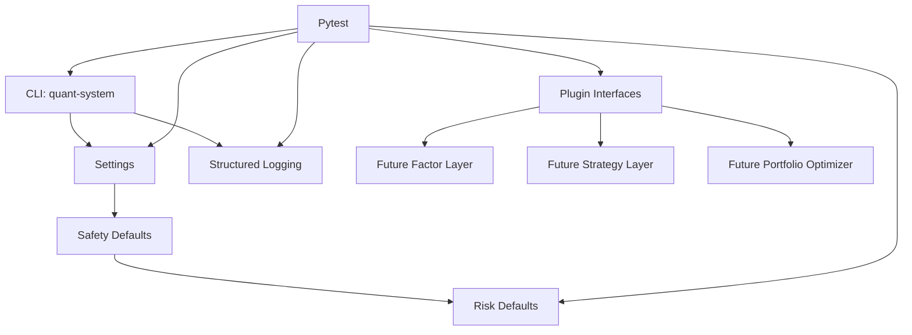
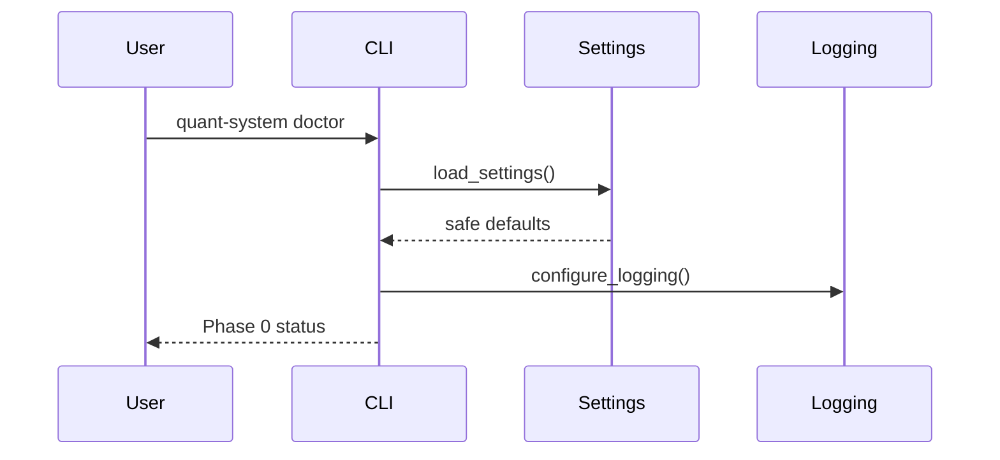

# Phase 0 架构文档

## 当前阶段系统架构

Phase 0 是工程基础层。它不运行交易，也不处理市场数据，只提供后续阶段共同依赖的入口和安全底座。



## 模块职责

### CLI

负责提供用户入口。

当前命令：

- `quant-system --help`
- `quant-system config show`
- `quant-system doctor`

### Settings

负责统一加载配置，并固定安全默认值。

### Logging

负责输出结构化 JSON 日志。

### Risk Defaults

负责集中保存 Phase 0 的保守风控默认值。

### Core Interfaces

负责定义未来扩展要遵守的最小接口：

- 因子接口
- 策略接口
- 组合优化器接口

## 文件职责

```text
.
├── .env.example
├── .gitignore
├── AI-assisted_quant_research_and_paper-trading_platform.code-workspace
├── environment.yml
├── pyproject.toml
├── README.md
├── Roan-on-X-the-Math-Needed-for-Trading-on-Polymarket-Complete-Roadmap(1).pdf
├── docs/
│   ├── SYSTEM_DESIGN_RESEARCH.md
│   ├── architecture/
│   │   └── phase_0_architecture.md
│   ├── delivery/
│   │   └── phase_0_delivery.md
│   ├── execution/
│   │   └── phase_0_execution.md
│   └── learning/
│       └── phase_0_learning.md
├── src/
│   └── quant_system/
│       ├── __init__.py
│       ├── cli.py
│       ├── config/
│       │   ├── __init__.py
│       │   └── settings.py
│       ├── core/
│       │   ├── __init__.py
│       │   └── interfaces.py
│       ├── logging/
│       │   ├── __init__.py
│       │   └── setup.py
│       └── risk/
│           ├── __init__.py
│           └── defaults.py
└── tests/
    ├── test_cli.py
    ├── test_interfaces.py
    ├── test_logging_setup.py
    ├── test_risk_defaults.py
    └── test_settings.py
```

## 数据流

当前阶段没有市场数据流，只有配置和命令流。



## 调用链

### 查看配置

```text
quant-system config show
-> quant_system.cli.show_config
-> quant_system.config.settings.load_settings
-> Settings / SafetySettings
-> JSON output
```

### 健康检查

```text
quant-system doctor
-> quant_system.cli.doctor
-> load_settings
-> configure_logging
-> status output
```

## 依赖关系

运行依赖：

- `pandas`
- `numpy`
- `pydantic`
- `pydantic-settings`
- `typer`
- `duckdb`
- `pyarrow`

开发依赖：

- `pytest`
- `ruff`

## 设计取舍

1. **先用标准 logging**

   Phase 0 只需要本地结构化日志。后续如果日志需求增加，再接更复杂工具。

2. **默认 conda + pip**

   设计文档已经调整为 conda 优先。`environment.yml` 负责创建环境，`pyproject.toml` 负责项目依赖。

3. **Phase 0 定义接口，但不实现业务**

   因子、策略和优化器只定义接口，避免过早写研究和交易逻辑。

4. **live trading 只保留防线，不开放能力**

   Phase 0 没有券商接口。即使有人设置 live trading，也必须通过确认短语校验。

## 扩展点

Phase 1 可扩展：

- 数据目录配置
- 数据源配置
- 数据校验 CLI
- 数据缓存日志

Phase 2 可扩展：

- 因子注册
- 因子计算 pipeline
- 因子报告

Phase 3 可扩展：

- 回测 CLI
- 回测配置
- 回测报告
