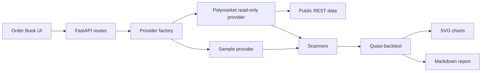

# Phase 11 Architecture - Polymarket Read-Only Research

Phase 11 adds read-only Polymarket research support on top of the existing
prediction-market module. It does not add live trading, wallet signing, private
key handling, order submission, token transfers, or redemption.

## Module Responsibilities

- `prediction_market/data/polymarket_readonly.py`: public REST GET requests for
  markets and order books.
- `prediction_market/provider_factory.py`: safe `sample` / `polymarket`
  provider selection.
- `prediction_market/storage.py`: JSONL snapshot persistence and replay.
- `prediction_market/backtest.py`: research-only quasi-backtest metrics.
- `prediction_market/charts.py`: deterministic SVG chart writer.
- `prediction_market/reporting.py`: markdown and JSON report output.
- `api/routes/prediction_market.py`: provider-selected read-only API routes.
- `frontend/app/order-book/page.tsx`: user-facing research workspace.

## Data Flow

## Safety Boundary

The provider has no methods for submit, sign, wallet, transfer, redeem, or live
execution. API requests containing credential-like fields are rejected.

## Design Tradeoff

Phase 11 uses JSONL for cached snapshots because order books are nested,
human-inspectable, and small enough that adding a chart or database dependency is
not necessary.
