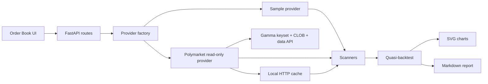

# Phase 11 架构 - Polymarket 只读研究

Phase 11 在现有的预测市场模块之上，新增了对 Polymarket 的只读研究支持。它不会
新增实盘交易、钱包签名、私钥处理、订单提交、代币转账或赎回功能。

## 模块职责

- `prediction_market/data/polymarket_readonly.py`：针对市场、订单簿、价格历史
  和成交记录的公开 REST GET 请求。
- `prediction_market/provider_factory.py`：安全的 `sample` / `polymarket`
  数据源选择。
- `prediction_market/storage.py`：JSONL 快照持久化、HTTP 缓存与
  回放。
- `prediction_market/backtest.py`：仅供研究用途的准回测指标。
- `prediction_market/charts.py`：确定性 SVG 图表写入器。
- `prediction_market/reporting.py`：markdown 与 JSON 报告输出。
- `api/routes/prediction_market.py`：按数据源选择的只读 API 路由。
- `frontend/app/order-book/page.tsx`：面向用户的研究工作区。

## 数据流

```mermaid
flowchart LR
  UI[Order Book UI] --> API[FastAPI routes]
  API --> Factory[Provider factory]
  Factory --> Sample[Sample provider]
  Factory --> PM[Polymarket read-only provider]
  PM --> PublicREST[Gamma keyset + CLOB + data API]
  PM --> Cache[Local HTTP cache]
  Sample --> Scanner[Scanners]
  PM --> Scanner
  Cache --> Scanner
  Scanner --> Backtest[Quasi-backtest]
  Backtest --> Charts[SVG charts]
  Backtest --> Report[Markdown report]
```

## 安全边界

该数据源没有任何用于提交、签名、钱包、转账、赎回或实盘
执行的方法。包含类似凭证字段的 API 请求将被拒绝。

## 设计权衡

Phase 11 使用 JSONL 来存储缓存快照，因为订单簿是嵌套结构、
便于人工查看，且体积足够小，以至于无需引入图表或数据库依赖。
对于公开 REST 调用，它还维护了一个轻量级 HTTP 缓存，以便
应用可以回放近期成功的响应，并在某个只读端点出现瞬时故障时降级到陈旧缓存。
