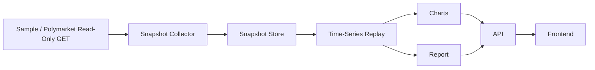

# Phase 12 架构文档

## 1. 这一阶段解决了什么

Phase 12 把预测市场模块从“看当前快照”推进到了“收历史、按时间回放”。

它新增了两条关键能力：

1. 历史快照采集  
   把公开市场和盘口按时间持续落到本地。

2. 时间序列回放  
   按快照时间顺序重新扫描机会，并在统一假设下计算模拟结果。

同时，股票主链也补齐了真实历史数据路径，让：

- Factor Lab
- Backtester
- Paper Trading

都能和 Market Data 一样走同一套真实数据来源。

---

## 2. 当前阶段系统架构

```text
                +---------------------------+
                |   stock provider factory  |
                |   sample / tiingo         |
                +-------------+-------------+
                              |
        +---------------------+----------------------+
        |                     |                      |
        v                     v                      v
  factor research       backtest run          paper trading run
        |                     |                      |
        +---------------------+----------------------+
                              |
                              v
                      metadata + reports


                +-------------------------------+
                | prediction market provider    |
                | sample / polymarket read-only |
                +---------------+---------------+
                                |
                                v
                        snapshot collector
                                |
                                v
                        snapshot store
                                |
                                v
                  time-series simulated replay
                                |
                     +----------+----------+
                     |                     |
                     v                     v
                  charts                report
                     |                     |
                     +----------+----------+
                                |
                                v
                         API + frontend
```

---

## 3. 模块职责

### 股票主链

- `src/quant_system/factors/pipeline.py`  
  根据 provider 拉取行情并生成因子结果。

- `src/quant_system/backtest/pipeline.py`  
  复用同一批行情，跑股票回测。

- `src/quant_system/execution/pipeline.py`  
  复用同一批行情和信号，跑 paper trading。

### 预测市场主链

- `src/quant_system/prediction_market/collector.py`  
  历史快照采集器。

- `src/quant_system/prediction_market/storage.py`  
  历史快照写入与区间读取。

- `src/quant_system/prediction_market/timeseries_backtest.py`  
  时间序列回放主逻辑。

- `src/quant_system/prediction_market/charts.py`  
  生成 PNG 图。

- `src/quant_system/prediction_market/reporting.py`  
  生成 JSON 和 Markdown 报告。

### API

- `src/quant_system/api/routes/factors.py`
- `src/quant_system/api/routes/backtest.py`
- `src/quant_system/api/routes/paper.py`
- `src/quant_system/api/routes/prediction_market.py`

这些路由只负责接请求、调已有服务、返回结果，不负责自己造业务逻辑。

### 前端

- `src/frontend/app/factor-lab/page.tsx`
- `src/frontend/app/backtest/page.tsx`
- `src/frontend/app/paper-trading/page.tsx`
- `src/frontend/app/order-book/page.tsx`

前端现在能：

- 触发真实股票数据链
- 触发预测市场历史采集
- 触发预测市场时间回放
- 展示结果与图表

---

## 4. 文件职责

| 文件 | 职责 |
|---|---|
| `collector.py` | 抓取历史快照并写盘 |
| `storage.py` | 按时间和 market 组织历史数据 |
| `timeseries_backtest.py` | 读取快照、扫描、过滤、模拟回放 |
| `charts.py` | 画累计收益、机会数、edge 分布、参数热力图 |
| `reporting.py` | 输出 markdown 报告 |
| `routes/prediction_market.py` | 暴露 collect / timeseries-backtest API |
| `PMHistoryBacktestForm.tsx` | 前端历史采集与回放面板 |

---

## 5. 数据流



---

## 6. 调用链

### 历史采集

1. CLI 或 API 收到 collect 请求
2. provider factory 选择 `sample` 或 `polymarket`
3. collector 拉取市场和盘口
4. store 把记录写到历史目录
5. API/CLI 返回摘要

### 时间序列回放

1. 前端或 CLI 提交起止时间和参数
2. store 读取历史区间
3. scanner 扫描机会
4. threshold 过滤
5. matching engine 做 simulated fill
6. 写出结果、图表、报告
7. API 返回结果与图表链接

---

## 7. 历史数据目录

```text
data/prediction_market/history/
  date=YYYY-MM-DD/
    market_id=<market_id>/
      market.json
      token_id=<token_id>.jsonl
```

说明：

- 原始快照保持追加写入
- 每个 token 一条单独轨迹
- 方便后面按日、按市场、按 token 回放

---

## 8. 设计取舍

### 为什么不用更复杂的数据库

这一阶段优先要的是：

- 可复现
- 好排查
- 本地可直接查看

所以先用目录分区 + JSONL。

### 为什么叫 simulated / quasi

因为这不是实盘成交回放。它没有真实延迟、真实抢单、真实结算，只是把当时看见的盘口用统一规则重新推一遍。

### 为什么默认 provider 仍是 sample

安全和稳定优先。真实 Polymarket 公共接口不稳定，sample 能保证离线可跑、测试可复现。

---

## 9. 扩展点

- 增加更多 scanner
- 增加更长的历史采集窗口
- 增加更细的撮合假设
- 把历史结果接入实验管理模块

---

## 10. 明确不做

本阶段明确不做：

- 实盘下单
- 钱包连接
- 私钥处理
- 签名
- 链上交互
- 真实 Polymarket 交易执行
