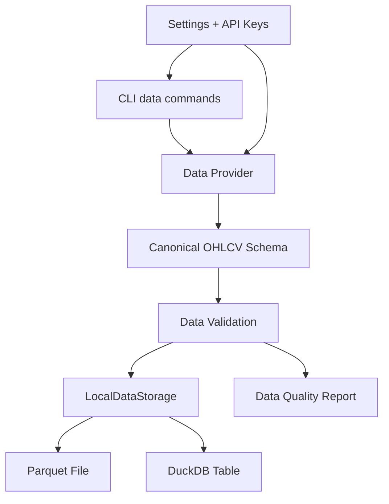
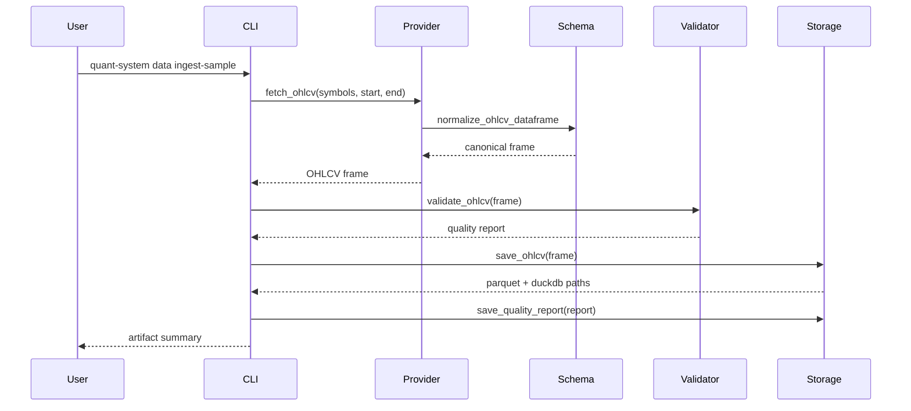

# Phase 1 架构文档

## 当前阶段系统架构

Phase 1 增加数据层 MVP。它的职责是把 OHLCV 数据变成可校验、可缓存、可重复读取的本地数据资产。

本阶段仍然不做策略、不做回测、不下单。



## 模块职责

### Data Providers

当前实现：

- `SampleOHLCVProvider`：生成确定性样例数据，用于本地验证和测试。
- `CSVDataProvider`：读取本地 CSV 文件。
- `TiingoEODProvider`：通过 Tiingo EOD 接口下载股票/ETF 日线数据。

### Schema

`normalize_ohlcv_dataframe` 把不同来源的数据统一成 Phase 1 标准字段：

- `symbol`
- `timestamp`
- `open`
- `high`
- `low`
- `close`
- `volume`
- `provider`
- `interval`
- `event_ts`
- `knowledge_ts`

其中：

- `event_ts` 表示市场事件发生时间。
- `knowledge_ts` 表示系统知道这条数据的时间。

这两个字段为后续防止未来函数和 point-in-time 回放预留基础。

### Validation

`validate_ohlcv` 检查：

- 必要字段是否存在
- 数据是否为空
- 同一 `symbol + timestamp` 是否重复
- OHLC 价格关系是否合理
- 成交量是否非负
- 必要字段是否有缺失值

### Storage

`LocalDataStorage` 同时写入：

- Parquet：便于后续按列读取和本地缓存
- DuckDB：便于本地 SQL 查询和质量检查
- Markdown quality report：便于人工阅读

### CLI

当前命令：

- `quant-system data ingest-sample`
- `quant-system data ingest-tiingo`
- `quant-system config show`

`config show` 会隐藏 API key，不会明文输出。

## 文件职责

```text
src/quant_system/data/
├── __init__.py
├── pipeline.py
├── schema.py
├── storage.py
├── validation.py
└── providers/
    ├── __init__.py
    ├── base.py
    ├── csv.py
    ├── sample.py
    └── tiingo.py
```

测试文件：

```text
tests/
├── test_data_pipeline_cli.py
├── test_data_schema.py
├── test_data_storage.py
├── test_data_tiingo_provider.py
└── test_data_validation.py
```

## 数据流



## 调用链

### 样例数据

```text
quant-system data ingest-sample
-> run_sample_ingestion
-> SampleOHLCVProvider.fetch_ohlcv
-> normalize_ohlcv_dataframe
-> validate_ohlcv
-> LocalDataStorage.save_ohlcv
-> LocalDataStorage.save_quality_report
```

### Tiingo 数据

```text
quant-system data ingest-tiingo
-> reload_settings
-> read QS_TIINGO_API_TOKEN
-> run_tiingo_ingestion
-> TiingoEODProvider.fetch_ohlcv
-> normalize_ohlcv_dataframe
-> validate_ohlcv
-> LocalDataStorage.save_ohlcv
-> LocalDataStorage.save_quality_report
```

## 依赖关系

Phase 1 使用：

- `pandas`
- `pyarrow`
- `duckdb`
- `pydantic`
- Python 标准库 `urllib`

没有新增 HTTP 客户端依赖。Tiingo 下载用标准库完成。

## 设计取舍

1. **默认不自动联网**

   免费 API 有额度限制。Phase 1 默认使用样例数据和本地 CSV，避免测试消耗额度。

2. **优先 Tiingo EOD**

   Tiingo 的日线接口简单，适合股票/ETF 历史缓存。它比新闻源和 X/Twitter 更贴近 Phase 1 的 OHLCV 目标。

3. **API key 只进 `.env`**

   `.env` 已被 git 忽略。`.env.example` 只保留空占位符。

4. **先做日线，不做分钟线和盘口**

   分钟线、盘口、WebSocket、公司行动和幸存者偏差处理会在后续阶段继续增强。

## 扩展点

后续可以新增：

- Alpha Vantage provider
- Polygon provider
- Finnhub provider
- Twelve Data provider
- Stooq/yfinance 免费数据 provider
- 数据源优先级和自动 fallback
- 分区 Parquet
- 数据版本和数据快照 ID
- corporate actions
- universe 快照

