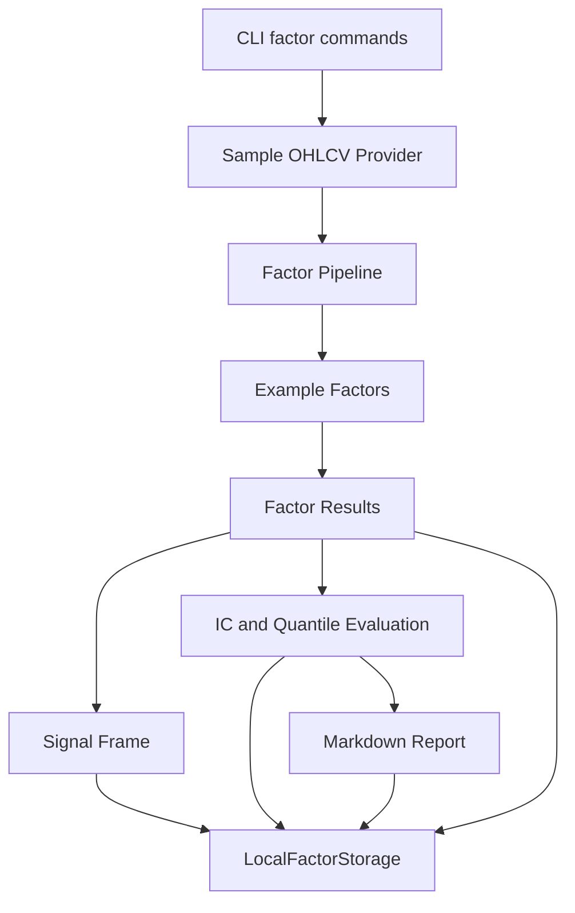
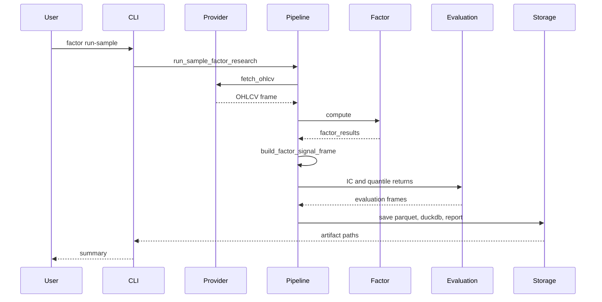

# Phase 2 架构文档

## 当前阶段系统架构

Phase 2 在 Phase 1 数据层之上增加因子研究层。它负责把 OHLCV 数据转换成可研究、可保存、可报告的信号结果。

本阶段仍然不做完整回测、不做组合优化、不做下单。



## 模块职责

### Base Factor

`BaseFactor` 统一因子输出格式。它负责：

- 检查输入数据字段
- 按 `symbol + timestamp` 排序
- 生成 `signal_ts`
- 生成下一根 K 线的 `tradeable_ts`
- 排除没有下一根 K 线的最后一行

### Example Factors

当前有三个示例因子：

- `MomentumFactor`：过去窗口的收盘价涨跌幅
- `VolatilityFactor`：过去窗口的收益波动
- `LiquidityFactor`：过去窗口的平均成交额

### Registry

`FactorRegistry` 管理可用因子。后续新增因子时，只需要注册新的类，不需要改主流程。

### Pipeline

`compute_factor_pipeline` 负责批量计算因子。

`build_factor_signal_frame` 负责生成给 Phase 3 使用的信号表。

`run_sample_factor_research` 负责串起样例数据、因子计算、评估、保存和报告。

### Evaluation

`calculate_information_coefficients` 计算 IC 和 Rank IC。

`calculate_quantile_returns` 计算分组收益。

注意：未来收益只在评估阶段使用，不参与因子计算。

### Storage

`LocalFactorStorage` 保存：

- 因子长表
- 因子信号宽表
- IC 结果
- 分组收益
- Markdown 报告
- DuckDB 表

## 文件职责

```text
src/quant_system/factors/
|-- __init__.py
|-- base.py
|-- examples.py
|-- registry.py
|-- pipeline.py
|-- evaluation.py
|-- storage.py
`-- reporting.py

tests/
|-- test_factors_examples.py
|-- test_factors_registry.py
|-- test_factors_pipeline.py
|-- test_factor_evaluation.py
`-- test_factor_storage_reporting_cli.py
```

## 数据流



## 调用链

```text
python -m quant_system.cli factor run-sample
-> run_sample_factor_research
-> SampleOHLCVProvider.fetch_ohlcv
-> compute_factor_pipeline
-> MomentumFactor.compute / VolatilityFactor.compute / LiquidityFactor.compute
-> build_factor_signal_frame
-> calculate_information_coefficients
-> calculate_quantile_returns
-> generate_factor_report
-> LocalFactorStorage.save_*
```

## 依赖关系

Phase 2 复用已有依赖：

- pandas
- numpy
- pydantic
- duckdb
- pyarrow
- typer
- pytest
- ruff

没有新增正式依赖。yfinance 只做了临时可用性测试，暂不加入项目依赖。

## 设计取舍

1. 先做简单因子，不做复杂建模。

   当前阶段重点是把研究流程跑通，而不是追求复杂策略。

2. 因子和交易执行彻底分离。

   因子只生成信号和分数，不生成订单。

3. 用 `signal_ts` 和 `tradeable_ts` 防止未来函数。

   这会让 Phase 3 的回测引擎明确知道信号何时产生、何时可用。

4. 报告使用 Markdown。

   Markdown 简单、可审计、便于 AI Agent 后续读取。

## 扩展点

后续可以扩展：

- 新增更多手写因子
- 增加因子参数配置
- 增加因子版本号管理
- 增加更完整的标准化、去极值、中性化
- 增加多因子合成
- 增加实验数据库
- 增加 HTML 或图表报告
- 接入 Phase 3 回测引擎
