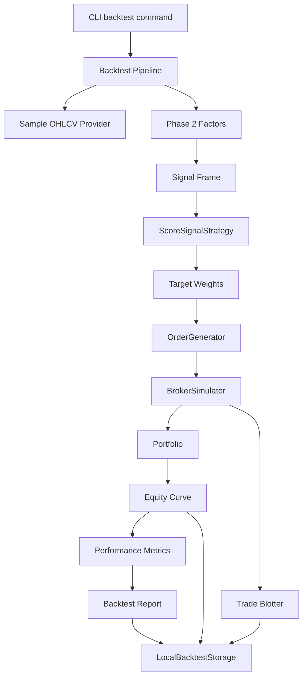
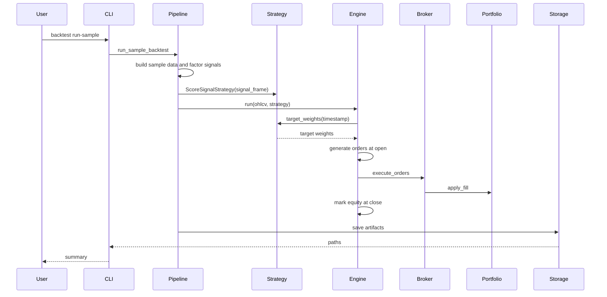

# Phase 3 架构文档

## 当前阶段系统架构

Phase 3 增加本地回测引擎。它读取 Phase 2 的信号，把信号转成目标权重，再由订单生成器、模拟券商和组合账户完成本地模拟。

本阶段仍然不做实盘、不做 paper trading、不接券商。



## 模块职责

### Strategy

`ScoreSignalStrategy` 只负责把 score 表转成目标权重。

它不接触：

- 现金
- 当前持仓
- 订单
- 成交
- 券商

### OrderGenerator

`OrderGenerator` 负责把目标权重转成订单。

它会比较：

- 当前持仓价值
- 目标持仓价值
- 当前开盘价

然后生成买入或卖出订单。

### BrokerSimulator

`BrokerSimulator` 负责模拟成交。

当前规则：

- 只支持市场订单式成交
- 默认 next bar open
- 买入价加滑点
- 卖出价减滑点
- 按成交金额扣手续费
- 卖单优先于买单成交
- 现金不足时买单会被缩小

### Portfolio

`Portfolio` 负责维护：

- 现金
- 持仓数量
- 持仓市值
- 总权益

### BacktestEngine

`BacktestEngine` 是主循环：

1. 按时间遍历行情。
2. 在 `tradeable_ts` 读取目标权重。
3. 用当日开盘价生成订单。
4. 通过模拟券商成交。
5. 用当日收盘价记录资金曲线。
6. 汇总交易记录和持仓记录。
7. 计算绩效指标。

### Metrics

`calculate_performance_metrics` 计算：

- total return
- annualized return
- volatility
- Sharpe
- max drawdown
- turnover

### Storage

`LocalBacktestStorage` 保存：

- `equity_curve.parquet`
- `trade_blotter.parquet`
- `orders.parquet`
- `positions.parquet`
- `metrics.json`
- `backtest_report.md`
- DuckDB 表

## 文件职责

```text
src/quant_system/backtest/
|-- __init__.py
|-- models.py
|-- strategy.py
|-- order_generation.py
|-- broker.py
|-- portfolio.py
|-- engine.py
|-- metrics.py
|-- storage.py
|-- reporting.py
`-- pipeline.py

tests/
|-- test_backtest_broker_portfolio.py
|-- test_backtest_strategy_orders.py
|-- test_backtest_engine_metrics.py
`-- test_backtest_storage_reporting_cli.py
```

## 数据流



## 调用链

```text
python -m quant_system.cli backtest run-sample
-> run_sample_backtest
-> SampleOHLCVProvider.fetch_ohlcv
-> compute_factor_pipeline
-> build_factor_signal_frame
-> ScoreSignalStrategy
-> BacktestEngine.run
-> OrderGenerator.generate_orders
-> BrokerSimulator.execute_orders
-> Portfolio.apply_fill
-> calculate_performance_metrics
-> generate_backtest_report
-> LocalBacktestStorage.save_*
```

## 依赖关系

Phase 3 没有新增第三方依赖。继续使用：

- pandas
- pydantic
- duckdb
- pyarrow
- typer
- pytest
- ruff

## 设计取舍

1. 先使用 next bar open。

   这是最容易解释、最容易测试、也最能避免未来函数的成交假设。

2. 策略不直接下单。

   策略只给目标权重，订单和成交由执行侧处理。

3. 不做复杂撮合。

   本阶段只做最小可信回测。盘口、排队、部分成交生命周期留到后续 paper trading 或高级市场模块。

4. 样例数据只用于验证工程流程。

   真正研究时应使用 Phase 1 的真实数据缓存。

## 扩展点

后续可以增加：

- 不同成交价格假设
- 订单类型
- 更复杂的滑点模型
- 行业和风格约束
- 多因子组合
- 参数搜索
- walk-forward
- 实验数据库
- paper trading loop
