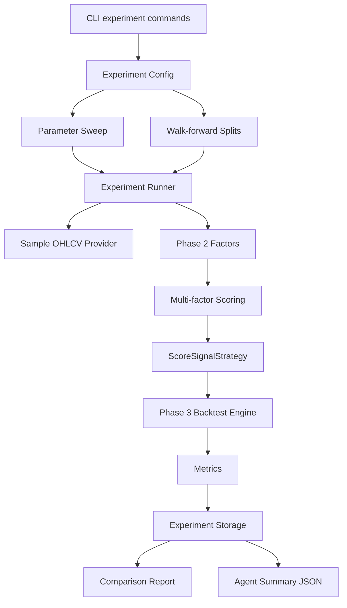
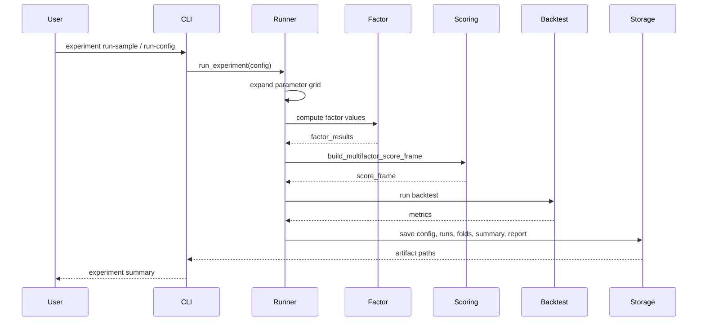

# Phase 4 架构文档

## 当前阶段系统架构

Phase 4 在 Phase 2 因子层和 Phase 3 回测层之上增加实验管理层。

它不替代因子层和回测层，而是负责编排：

- 多因子组合
- 参数组合
- walk-forward
- 结果保存
- 结果对比
- AI 可读摘要



## 模块职责

### Experiment Config

`ExperimentConfig` 保存：

- 实验名称
- 标的列表
- 时间范围
- 成本和滑点
- 多因子配置
- 参数 sweep
- walk-forward 配置

### Multi-factor Scoring

`build_multifactor_score_frame` 负责：

- 按 `signal_ts` 做横截面标准化
- 处理因子方向
- 按权重合成 score
- 根据 rebalance 配置过滤交易日期

### Parameter Sweep

`expand_parameter_grid` 会把配置里的参数列表展开成多个 run。

例如：

```text
lookback=[3,5]
top_n=[1,2]
```

会生成 4 个 run。

### Walk-forward

`build_walk_forward_splits` 会生成明确的：

- train_start
- train_end
- validation_start
- validation_end

本阶段不会训练复杂模型，只用这些边界来保证验证流程可审计。

### Runner

`run_experiment` 是主流程：

1. 读取配置。
2. 获取样例数据。
3. 展开参数组合。
4. 计算因子。
5. 合成多因子 score。
6. 调用 Phase 3 回测。
7. 汇总每个 run 的指标。
8. 保存结果和报告。

### Storage

`LocalExperimentStorage` 保存：

- `experiment_config.json`
- `experiment_runs.parquet`
- `walk_forward_folds.parquet`
- `agent_summary.json`
- `experiment_comparison_report.md`
- DuckDB 表

## 文件职责

```text
src/quant_system/experiments/
|-- __init__.py
|-- models.py
|-- config.py
|-- scoring.py
|-- sweep.py
|-- walk_forward.py
|-- runner.py
|-- storage.py
`-- reporting.py

tests/
|-- test_experiment_scoring.py
|-- test_experiment_config_sweep.py
|-- test_experiment_walk_forward.py
`-- test_experiment_runner_cli.py
```

## 数据流



## 调用链

```text
python -m quant_system.cli experiment run-sample
-> run_sample_experiment
-> create_sample_experiment_config
-> run_experiment
-> expand_parameter_grid
-> compute_factor_pipeline
-> build_multifactor_score_frame
-> ScoreSignalStrategy
-> BacktestEngine.run
-> LocalExperimentStorage.save_*
```

## 防止 data leakage 的设计

- 因子值仍然来自 Phase 2，带有 `signal_ts` 和 `tradeable_ts`。
- 标准化只在同一 `signal_ts` 的横截面内进行。
- 回测只在 `tradeable_ts` 执行。
- walk-forward 只在 validation 区间计算绩效。
- agent summary 只做研究总结，不做上线决策。

## 依赖关系

Phase 4 没有新增第三方依赖。继续使用：

- pandas
- pydantic
- duckdb
- pyarrow
- typer
- pytest
- ruff

配置文件使用 JSON，暂不引入 YAML 依赖。

## 设计取舍

1. 先用 JSON 配置。

   这样不需要新增依赖，格式稳定，AI Agent 也容易读取。

2. 先做简单参数 sweep。

   当前阶段目标是可复现实验管理，不做复杂优化器。

3. walk-forward 不训练模型。

   因为本阶段没有机器学习模型，train 区间主要用于边界记录和历史窗口。

4. 不自动选择上线策略。

   报告可以排序结果，但不会修改 live 配置或触发交易。

## 扩展点

后续可以增加：

- 实验数据库
- MLflow
- 更丰富的参数空间
- 实验标签
- HTML 报告
- 图表
- AI 自动总结报告
- 因子中性化和去极值
- 更完整的 walk-forward 训练逻辑
