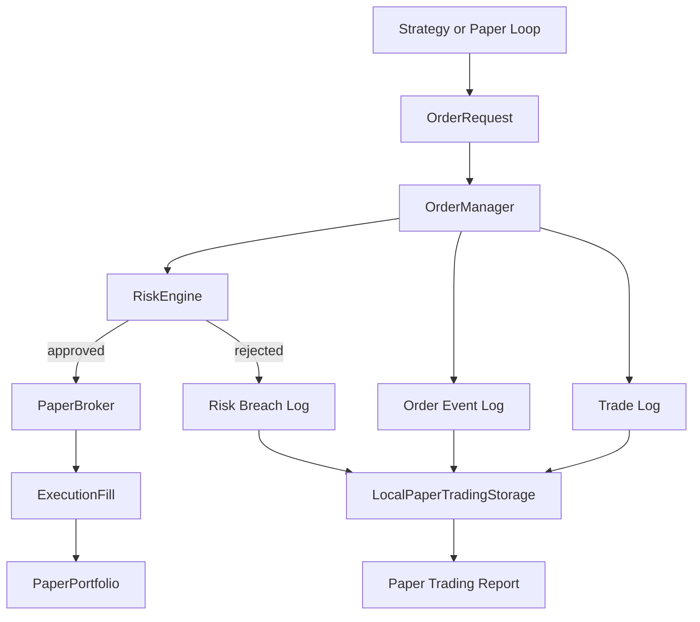

# Phase 5 架构文档

## 当前阶段系统架构

Phase 5 增加风控、订单生命周期和 paper broker。

它的位置在策略和 broker 之间：



## 模块职责

### RiskEngine

`RiskEngine` 只做风控判断，不知道策略，也不知道 broker。

当前规则：

- kill switch
- max position size
- max order value
- max daily loss
- max drawdown
- allowed symbols
- blocked symbols

### OrderManager

`OrderManager` 是订单入口。

职责：

- 创建订单
- 记录 created
- 调用 risk engine
- 拒绝不合规订单
- 提交合规订单
- 记录 submitted / partially_filled / filled / cancelled / rejected
- 保存交易日志和风控违规日志

### BrokerAdapter

`BrokerAdapter` 是未来 paper broker 和 live broker 共用的接口。

当前实现是 `PaperBroker`。

### PaperBroker

`PaperBroker` 负责模拟：

- 提交订单
- 取消订单
- 根据市场价格成交
- 部分成交
- 手续费和滑点
- 更新 paper portfolio

### PaperPortfolio

`PaperPortfolio` 负责：

- 现金
- 持仓
- 市值
- 权益

## 文件职责

```text
src/quant_system/risk/
|-- __init__.py
|-- defaults.py
|-- models.py
`-- engine.py

src/quant_system/execution/
|-- __init__.py
|-- models.py
|-- broker.py
|-- paper_broker.py
|-- portfolio.py
|-- order_manager.py
|-- pipeline.py
|-- storage.py
`-- reporting.py

tests/
|-- test_risk_engine_phase5.py
|-- test_order_manager_paper_broker.py
`-- test_paper_trading_pipeline_cli.py
```

## 数据流

```mermaid
sequenceDiagram
    participant Loop
    participant OM as OrderManager
    participant Risk as RiskEngine
    participant Broker as PaperBroker
    participant Portfolio
    participant Storage

    Loop->>OM: create_and_submit(OrderRequest)
    OM->>OM: log created
    OM->>Risk: check_order
    alt approved
        OM->>Broker: submit_order
        OM->>OM: log submitted
        Loop->>OM: process_market_data
        OM->>Broker: process_market_data
        Broker->>Portfolio: apply_fill
        Broker-->>OM: fills
        OM->>OM: log partially_filled / filled
    else rejected
        OM->>OM: log rejected
        OM->>OM: store risk breach
    end
    OM->>Storage: save orders, events, trades, breaches
```

## 调用链

```text
python -m quant_system.cli paper run-sample
-> run_sample_paper_trading
-> SampleOHLCVProvider.fetch_ohlcv
-> RiskEngine
-> OrderManager.create_and_submit
-> PaperBroker.submit_order
-> OrderManager.process_market_data
-> PaperBroker.process_market_data
-> PaperPortfolio.apply_fill
-> LocalPaperTradingStorage.save_*
-> generate_paper_trading_report
```

## 设计取舍

1. 风控独立于策略。

   这样任何策略、实验或未来 live adapter 都不能绕过风控入口。

2. Paper broker 实现 broker 接口。

   Phase 6 接真实 broker 时，可以复用订单管理层。

3. 部分成交先做最小模拟。

   当前按每次 tick 的比例成交，后续可扩展为盘口深度、排队和超时。

4. 日志先保存为 Parquet / DuckDB / Markdown。

   这和前面阶段保持一致，也便于审计。

## 扩展点

后续可以增加：

- 更细的订单类型
- 超时和重试
- cancel / replace
- broker sandbox adapter
- IBKR / Alpaca / crypto adapter
- Prometheus / Grafana
- 实时风控告警
- 更真实的成交模型
