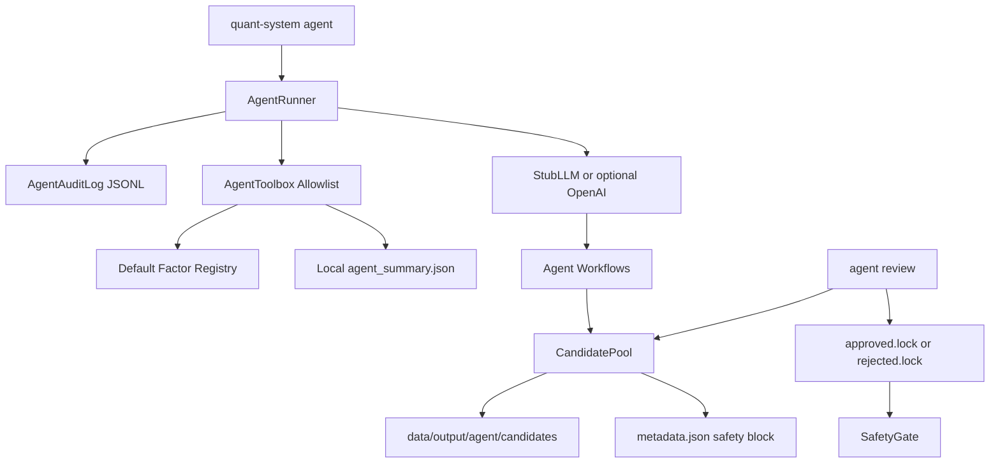
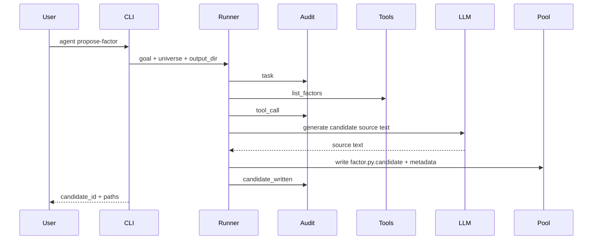

# Phase 7 架构文档

## 当前阶段系统架构

Phase 7 增加 AI 研究助手。它只做研究辅助：读实验摘要、列出已有因子、生成候选因子源码、生成候选实验配置、生成报告和检查清单。

它不下单，不注册因子，不修改风控参数，也不把任何候选策略推入 paper trading。



## 模块职责

### `models.py`

定义 Agent 任务、消息、决策、候选产物和人工 review 记录。所有模型使用 Pydantic v2，便于 JSON 落盘和测试。

### `llm/`

`LLMClient` 是协议接口。默认 `StubLLMClient` 完全离线、确定性输出，测试不依赖 API key。`OpenAIClient` 只有在 CLI 显式传 `--llm openai` 且存在 `QS_OPENAI_API_KEY` 时才构造。

### `tools.py`

`AgentToolbox` 是固定白名单。工具只允许：

- 读取本地实验摘要
- 列出现有因子
- 列出已有策略入口
- 生成候选因子源码文本
- 生成候选实验配置

它不接收任意 callable，也不提供 shell、文件任意写入、券商、网络下单能力。

### `candidate_pool.py`

候选产物统一写入：

```text
<output-dir>/agent/candidates/<candidate_id>/
├── factor.py.candidate
├── experiment_config.json
├── metadata.json
├── reviews.jsonl
├── approved.lock
└── rejected.lock
```

候选因子使用 `.candidate` 后缀，避免被 pytest 或 Python import 机制误收集。系统不会 import、exec 或 compile 候选源码。

### `audit.py`

每个 Agent task 写一个 JSONL 审计文件：

```text
<output-dir>/agent/audit/<task_id>.jsonl
```

至少记录 task、tool_call、candidate_written 或 review_recorded。

### `safety.py`

`SafetyGate` 默认拒绝升级。只有候选目录中存在人工 review 生成的 `approved.lock`，`allow_promotion(candidate_id)` 才返回 `True`。

注意：即使存在 `approved.lock`，当前 Phase 7 也不会自动把候选注册进因子库。注册仍然需要人工把候选文件改名、审查、测试并显式接入。

## CLI

```powershell
quant-system agent propose-factor --goal "low-vol momentum" --universe SPY,QQQ --output-dir data/agent_run
quant-system agent propose-experiment --goal "test momentum blend" --output-dir data/agent_run
quant-system agent summarize --experiment-id <id> --output-dir data/agent_run
quant-system agent audit-leakage --factor-id momentum --output-dir data/agent_run
quant-system agent list-candidates --output-dir data/agent_run
quant-system agent review --candidate-id <id> --decision approve --note "manual review passed" --output-dir data/agent_run
```

## 数据流



## 设计取舍

1. 默认使用离线 stub，而不是默认调用外部 LLM。

   这样测试稳定，也避免 API key 和网络状态影响本地研究链路。

2. 候选源码只落盘，不执行。

   这可以抵御 prompt injection 生成的危险 Python 代码。

3. review 只写锁文件，不自动注册。

   人工 approve 只是进入下一步人工流程，不代表候选已经可运行。

4. Agent 与交易执行层没有依赖。

   Phase 7 不 import broker，不生成订单，也不修改 risk limits。

## 扩展点

- 增加更多只读工具，例如读取回测报告、列出实验指标。
- 增加更严格的候选代码静态检查。
- 增加人工 review 表单或 dashboard。
- 增加 Langfuse / OpenTelemetry 等审计后端。

所有扩展仍必须保持：Agent 不能下单、不能自动注册、不能绕过风控。
