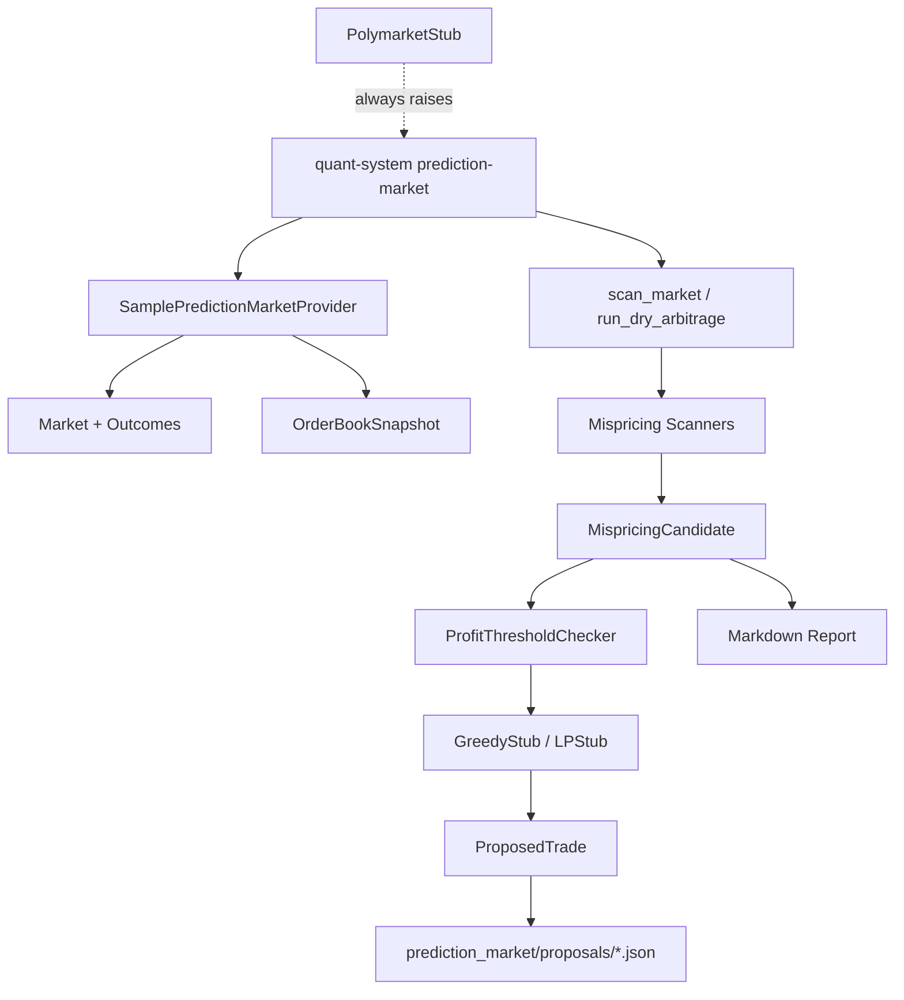

# Phase 8 架构文档

## §8.1 模块图

Phase 8 增加 prediction market / Polymarket 扩展骨架。它只做本地样例数据、只读扫描、dry proposal 输出和接口占位。

它不连接 Polymarket live API，不发 HTTP，不开 WebSocket，不签名，不转账，不提交订单。



## §8.2 数据模型

核心模型位于 `src/quant_system/prediction_market/models.py`：

- `Event`：事件容器。
- `Market`：一个可交易问题，包含 condition id 和 outcomes。
- `Condition`：未来映射链上 condition 的占位模型。
- `Outcome` / `OutcomeToken`：结果和 token 映射。
- `OrderBookSnapshot`：某个 outcome token 的 bids / asks 快照。
- `CLOBOrder`：价格和数量，不包含发送、签名、提交方法。
- `MispricingCandidate`：scanner 发现的不一致。
- `ProposedTrade`：optimizer 输出的 dry proposal。

`CLOBOrder` 只是数据模型，没有 `send`、`sign`、`submit` 方法。

## §8.3 Scanner / Optimizer 边界

Scanner 只做发现：

- `YesNoArbitrageScanner`：二元市场 YES + NO best ask 低于 1 时输出候选。
- `OutcomeSetConsistencyScanner`：完整 outcome 集合 best ask 总和偏离 1 时输出候选。

Optimizer 只做 dry proposal：

- `GreedyStub`：按资本上限生成简单 proposed legs。
- `LPStub`：可选 scipy 占位，只处理最小 LP 入口，不实现高级算法。

`ProfitThresholdChecker` 在 optimizer 前过滤低 edge 候选。

设计边界：

- scanner 不知道 broker。
- optimizer 不知道 broker。
- `run_dry_arbitrage` 只写 `proposals/*.json`。
- 没有 orders、fills、token transfers 输出。

## §8.4 为什么 Polymarket Live 不接入

本阶段不接 live 的原因：

1. Polymarket CLOB / Gamma / 链上结算涉及 API、签名、token、resolution 风险，不能和研究 MVP 混在一起。
2. 多腿套利需要严格处理 partial fill，否则单腿成交后可能暴露方向性风险。
3. 复杂求解器、Frank-Wolfe、Barrier Frank-Wolfe、整数规划都需要独立验证，不能直接进入执行链路。
4. 当前系统安全边界要求所有新模块默认 dry-run / paper-only。

因此 `PolymarketStub` 只保留 endpoint 字符串和方法签名；任何调用都会抛：

```text
Polymarket live integration is intentionally not wired in Phase 8
```

## 文件职责

```text
src/quant_system/prediction_market/
├── models.py
├── instruments.py
├── data/
│   ├── base.py
│   ├── sample_provider.py
│   └── polymarket_stub.py
├── orderbook.py
├── scanners/
│   ├── yes_no_arbitrage.py
│   └── outcome_set_consistency.py
├── optimizer/
│   ├── base.py
│   ├── greedy_stub.py
│   └── lp_stub.py
├── execution_threshold.py
├── partial_fill.py
├── settlement.py
├── pipeline.py
└── reporting.py
```

## 扩展点

后续可以扩展：

- 真实 Gamma market discovery adapter。
- CLOB order book WebSocket ingestion。
- 事件和 condition 逻辑约束图。
- 更严格的多腿 partial fill recovery。
- settlement / resolution risk tracker。
- 可选 OR-Tools / scipy optimizer。

这些扩展仍必须保持 dry-run 默认，不允许绕过风控或直接实盘。
