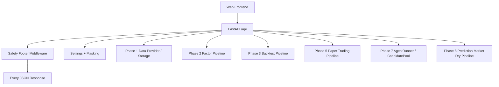

# Phase 9 API Architecture

## 目标

Phase 9 增加一个本地优先、读多写少的 HTTP API，供后续 Web 前端读取已有研究、回测、paper trading、AI Agent 和 prediction market dry-run 结果。

它不是交易网关，不提供真实下单、签名、钱包、broker 或 live 路由。

## 架构图



## 模块职责

- `src/quant_system/api/server.py`：创建 FastAPI app，挂载路由，配置 CORS 和安全中间件。
- `src/quant_system/api/bootstrap.py`：只构造 `Settings`、解析输出目录、写入 `app.state`。
- `src/quant_system/api/dependencies.py`：从 `app.state` 取 settings、输出目录和运行目录。
- `src/quant_system/api/safety/middleware.py`：给所有 JSON 响应追加 `safety`，并拒绝未确认的 `0.0.0.0` 绑定。
- `src/quant_system/api/safety/masking.py`：屏蔽 settings 中的 key、secret、token、password、private 字段。
- `src/quant_system/api/routes/*`：薄 HTTP 包装层，调用 Phase 1-8 已有函数。

## 安全边界

每个 JSON 响应都包含：

```json
{
  "safety": {
    "dry_run": true,
    "paper_trading": true,
    "live_trading_enabled": false,
    "kill_switch": true,
    "bind_address": "127.0.0.1"
  }
}
```

默认只绑定 `127.0.0.1`。如果要绑定 `0.0.0.0`，必须同时满足：

- CLI 显式传入 `--bind-public`
- 环境变量 `QS_API_ALLOW_PUBLIC_BIND=I_UNDERSTAND`

## 设计取舍

- 不加 ORM：当前输出仍是本地 Parquet / JSON / Markdown。
- 不加后台任务：sample 数据上的 backtest 和 paper trading 能同步完成。
- 不加 WebSocket：Phase 9 只服务前端读取和触发本地轻量任务。
- 不加鉴权：这是本地工具，安全边界靠 loopback 绑定和不暴露 live 能力。
- 不导入或执行 Agent 候选源码：候选文件只作为文本预览。

## 扩展点

- 后续前端可直接消费 `/api/*`。
- 更重任务可在未来加 job runner，但不能绕过当前安全 footer 和 kill switch 规则。
- 真实 broker / live trading 不属于 Phase 9。
