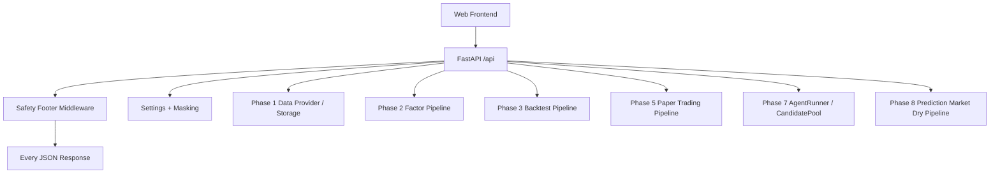

# Phase 9 API Architecture

## 目标

Phase 9 增加一个本地优先、读多写少的 HTTP API，供后续 Web 前端读取已有研究、回测、paper trading、AI Agent 和 prediction market dry-run 结果。

它不是交易网关，不提供真实下单、签名、钱包、broker 或 live 路由。

## 架构图


```mermaid
flowchart TD
    UI[Web Frontend] --> API[FastAPI /api]
    API --> Safety[Safety Footer Middleware]
    API --> Settings[Settings + Masking]
    API --> Data[Phase 1 Data Provider / Storage]
    API --> Factors[Phase 2 Factor Pipeline]
    API --> Backtest[Phase 3 Backtest Pipeline]
    API --> Paper[Phase 5 Paper Trading Pipeline]
    API --> Agent[Phase 7 AgentRunner / CandidatePool]
    API --> PM[Phase 8 Prediction Market Dry Pipeline]
    Safety --> JSON[Every JSON Response]
```

## 模块职责

- `src/quant_system/api/server.py`：创建 FastAPI app，挂载路由，配置 CORS 和安全中间件。
- `src/quant_system/api/bootstrap.py`：只构造 `Settings`、解析输出目录、写入 `app.state`。
- `src/quant_system/api/dependencies.py`：从 `app.state` 取 settings、输出目录和运行目录。
- `src/quant_system/api/safety/middleware.py`：给所有 JSON 响应追加 `safety`，并拒绝未确认的 `0.0.0.0` 绑定。
- `src/quant_system/api/safety/masking.py`：屏蔽 settings 中的 key、secret、token、password、private 字段。
- `src/quant_system/api/schemas/*`：集中放置 Pydantic request / response schema，用于 OpenAPI 契约和前后端字段防漂移。2026-06-15 起，`/api/health`、`/api/symbols`、`/api/ohlcv`、`/api/benchmark`、`/api/backtests`、`/api/backtests/{run_id}`、`/api/experiments`、`/api/experiments/{experiment_id}`、`/api/paper`、`/api/paper/{run_id}`、`/api/paper/account`、`/api/paper/account/ledger`、`/api/paper/run`、`/api/paper/account/reset`、`/api/paper/account/kill-switch`、`/api/paper/account/orders`、`/api/paper/account/orders/process`、`/api/paper/account/orders/{order_id}/cancel`、`/api/paper/account/rebalance`、`/api/replications/reversal-momentum/{run_id}`、`/api/settings`、`/api/strategies`、`/api/universes`、`/api/factors`、`/api/factors/lab`、`/api/factors/runs`、`/api/factors/{run_id}`、`/api/runs/recent`、`/api/market-data/history`、`/api/options/daily-scan/dates`、`/api/options/daily-scan/status`、`/api/options/daily-scan`、`/api/options/daily-scan/symbol/{ticker}`、`/api/options/refresh/universe`、`/api/options/refresh/earnings`、`/api/options/refresh/vix`、`/api/options/daily-scan/run`、`/api/options/screener`、`/api/options/tools/greeks`、`/api/options/tools/implied-volatility`、`/api/options/tools/simulate`、`/api/options/tools/strategy/build`、`/api/options/tools/score-contracts`、`/api/options/tools/strategy/rank`、`/api/options/tools/bull-put-signal`、`/api/options/tools/fear-score`、`/api/options/tools/iv-rank`、`/api/options/tools/market-sentiment`、`/api/options/tools/earnings-crush`、`/api/options/tools/hedge-advisor`、`/api/options/tools/unusual-activity`、`/api/options/tools/watchlist`、`/api/options/tools/alerts/evaluate`、`/api/options/tools/health-check`、`/api/factors/run`、`/api/backtests/run`、`/api/experiments/run`、`/api/replications/reversal-momentum/run`、`/api/options/expirations`、`/api/options/chain`、`/api/options/snapshot/{ticker}`、`/api/options/tools/vol-surface/{ticker}`、`/api/options/tools/vol-smile/{ticker}`、`/api/agent/candidates`、`/api/agent/candidates/{candidate_id}`、`/api/agent/tasks`、`/api/agent/candidates/{candidate_id}/review`、`/api/agent/llm-config`、`/api/options/tools/strategy/templates`、`/api/prediction-market/markets`、`/api/prediction-market/results/{run_id}`、`/api/prediction-market/timeseries-backtest/{run_id}`、`/api/prediction-market/scan`、`/api/prediction-market/collect`、`/api/prediction-market/dry-arbitrage`、`/api/prediction-market/backtest`、`/api/prediction-market/timeseries-backtest` 已先挂 `response_model`；`/api/prediction-market/timeseries-backtest/{run_id}/artifacts/{artifact_name}` 是非 JSON `FileResponse`。OpenAPI 当前 40 个 POST JSON 响应均已挂 `$ref` response schema。
- `tests/test_api_response_models.py` 会全局扫描 OpenAPI，要求所有 `200 application/json` 响应都引用 `components/schemas/*`，避免新增路由绕过 response model。
- `src/quant_system/api/routes/*`：薄 HTTP 包装层，调用 Phase 1-8 已有函数。

## 安全边界

每个 JSON 响应都包含：

```json
{
  "safety": {
    "dry_run": true,
    "paper_trading": true,
    "live_trading_enabled": false,
    "kill_switch": true,
    "bind_address": "127.0.0.1"
  }
}
```

默认只绑定 `127.0.0.1`。如果要绑定 `0.0.0.0`，必须同时满足：

- CLI 显式传入 `--bind-public`
- 环境变量 `QS_API_ALLOW_PUBLIC_BIND=I_UNDERSTAND`

## 设计取舍

- 不加 ORM：当前输出仍是本地 Parquet / JSON / Markdown。
- 不加后台任务：sample 数据上的 backtest 和 paper trading 能同步完成。
- 不加 WebSocket：Phase 9 只服务前端读取和触发本地轻量任务。
- 不加鉴权：这是本地工具，安全边界靠 loopback 绑定和不暴露 live 能力。
- 不导入或执行 Agent 候选源码：候选文件只作为文本预览。

## 扩展点

- 后续前端可直接消费 `/api/*`。
- 更重任务可在未来加 job runner，但不能绕过当前安全 footer 和 kill switch 规则。
- 真实 broker / live trading 不属于 Phase 9。
