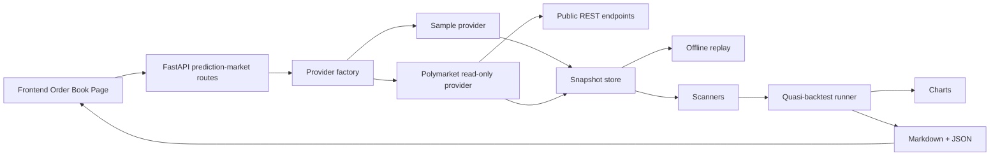

# Phase 11 设计规格 - Polymarket 只读研究扩展

## 1. 范围

Phase 11 为本地 AI 量化平台新增一个安全的 Polymarket 研究扩展。
它支持只读的市场发现、只读的订单簿摄取、缓存
数据集、扫描器/准回测实验、图表、报告、后端 API，以及
前端控件。

本阶段仅用于研究。它不会下单、签名消息、连接
钱包、处理私钥、转移代币、赎回仓位，也不声明具备实盘
交易能力。

## 2. 非目标

- 无实盘交易。
- 无真实订单提交。
- 无钱包连接。
- 无私钥或 API 密钥处理。
- 无链上 RPC、赎回或结算交易。
- Phase 11 不做 WebSocket 流式传输。REST 快照足以满足可复现的
  研究需求。WebSocket 摄取留待后续阶段。
- 无高频执行、对延迟敏感的策略，或保证盈利的
  声明。

## 3. 当前审计摘要

现有可复用部分：

- `src/quant_system/prediction_market/models.py`：事件、市场、结果、订单
  簿、候选项与拟议交易数据模型。
- `data/base.py`：provider 协议。
- `data/sample_provider.py`：确定性的样本数据。
- `pipeline.py`：扫描器执行与 dry 提案写入。
- `scanners/`：yes/no 与完整集 (complete-set) 价格一致性扫描器。
- `optimizer/greedy_stub.py`：dry 提案优化器。
- `api/routes/prediction_market.py`：只读样本端点。
- `src/frontend/app/order-book/page.tsx` 与 `PMRunForm.tsx`：当前前端
  样本工作流。

缺失部分：

- 真实的只读 Polymarket REST provider。
- 用于 `sample` 与 `polymarket` 的 provider 工厂。
- 缓存/持久化与离线回放。
- 准回测结果模型与运行器。
- 图表与报告索引。
- 前端 provider 选择与结果/报告展示。
- Phase 11 文档、故障排查与安全指南。

请勿改动：

- 保持 `dry_run`、`paper_trading`、`kill_switch` 安全的风险默认值。
- Agent 候选项晋升规则。
- 任何实盘券商、钱包、签名或订单提交接口。
- 现有 Phase 0-10 行为，除非是有限地扩展只读预测
  市场 API/UI。

工作区中已存在的风险信号：

- `src/quantum-core-algorithmic-trading-platform.zip` 未被跟踪。在
  人工检查并给出正当理由之前，不应将其提交。

## 4. 数据流



## 5. 后端边界

新增或扩展的后端模块：

- `prediction_market/data/polymarket_readonly.py`：只读 REST provider。
- `prediction_market/provider_factory.py`：安全的 provider 选择。
- `prediction_market/storage.py`：JSONL 快照持久化与回放。
- `prediction_market/backtest.py`：准回测运行器与指标。
- `prediction_market/charts.py`：确定性 SVG 图表。
- `prediction_market/reporting.py`：用 Phase 11 摘要扩展现有报告写入器。
- `api/routes/prediction_market.py`：新增 provider 选择、fetch/cache、
  backtest/report 端点。

该 provider 绝不暴露 submit/sign/send 方法。`CLOBOrder` 仅作为数据
模型存在。

## 6. 前端边界

仅扩展现有的预测市场页面与表单：

- `app/order-book/page.tsx`
- `components/forms/PMRunForm.tsx`
- 若需要响应辅助方法，则扩展 `lib/api.ts` 与 `lib/apiClient.ts`。

UI 文案必须表明这是只读研究模式。任何按钮都不得提及 trade、submit
order、connect wallet、sign 或 redeem。

## 7. Provider 抽象

Provider 选项：

- `sample`：确定性本地 provider。默认。
- `polymarket`：真实的只读 REST provider。仅在显式指定时使用。
- `replay`：由已持久化快照支撑的离线数据集 provider。在存在缓存
  数据时可选。

Phase 11 交付后的实现说明：

- 当请求包含正常的只读 `User-Agent` 头时，真实的公共 GET 访问
  在本环境中可用。
- Gamma 发现现使用 `/markets/keyset`，而非已弃用的
  `/markets` 端点。

选择规则：

- 默认：`sample`。
- 请求参数可选择 `sample` 或 `polymarket`。
- 未知 provider 返回前端可读的 400。
- `polymarket_api_key` 或任何类似凭据的请求字段返回 400。

## 8. 配置与安全默认值

配置嵌套在 `Settings.prediction_market` 之下，并带有安全默认值：

| 名称 | 默认值 | 类型 | 用途 | 安全行为 |
|---|---:|---|---|---|
| `QS_PREDICTION_MARKET_PROVIDER` | `sample` | string | 默认 provider | 无网络 |
| `QS_POLYMARKET_GAMMA_BASE_URL` | `https://gamma-api.polymarket.com` | string | 市场发现 | 只读 |
| `QS_POLYMARKET_CLOB_BASE_URL` | `https://clob.polymarket.com` | string | 订单簿快照 | 只读 |
| `QS_POLYMARKET_DATA_API_BASE_URL` | `https://data-api.polymarket.com` | string | 公共成交端点 | 只读 |
| `QS_POLYMARKET_REQUEST_TIMEOUT_SECONDS` | `10` | int | HTTP 超时 | 快速失败 |
| `QS_POLYMARKET_MAX_RETRIES` | `2` | int | 瞬时重试 | 有上限 |
| `QS_POLYMARKET_RATE_LIMIT_PER_SECOND` | `2.0` | float | 请求节流 | 保守 |
| `QS_POLYMARKET_CACHE_DIR` | `data/prediction_market` | path | 缓存目录 | 仅本地 |
| `QS_POLYMARKET_CACHE_TTL_SECONDS` | `300` | int | 新鲜缓存有效期 | 减少重复调用 |
| `QS_POLYMARKET_CACHE_STALE_IF_ERROR_SECONDS` | `86400` | int | 陈旧回退窗口 | 更安全的离线回放 |
| `QS_POLYMARKET_USER_AGENT` | `ai-quant-platform/phase11` | string | 公共只读请求标识 | 避免被模糊地拦截请求 |
| `QS_POLYMARKET_READ_ONLY` | `true` | bool | 安全断言 | 必须保持为 true |

任何配置都不需要密钥。

## 9. 重试、超时与限速

- 每个 HTTP 请求都有超时。
- 仅对 GET 请求且仅在瞬时网络故障时重试。
- 在请求之间使用一个短暂的同步 sleep，以避免快速突发。
- 不对无效 schema 的响应进行重试。
- 缓存策略可按请求选择：`prefer_cache`、`refresh`、
  `network_only`。
- 如果在成功写入缓存后网络失败，provider 可在配置的安全窗口内
  回退到陈旧缓存。
- 将 provider 错误映射为清晰的 HTTP 400/502/504 响应，而不暴露原始堆栈跟踪。

## 10. 错误处理

Provider 错误被规范化：

- timeout -> `provider_timeout`
- 非 2xx 响应 -> `provider_http_error`
- JSON 格式错误或意外 schema -> `provider_invalid_response`
- 未知 provider -> `unknown_provider`
- 请求中包含凭据 -> `credentials_not_allowed`

API 响应保留现有的安全页脚。

## 11. 持久化策略

Phase 11 预测市场快照使用 JSONL，而非 Parquet，原因是：

- 订单簿是嵌套且小巧的。
- JSONL 易于检视与回放。
- 不需要额外依赖。

路径模式：

```text
data/prediction_market/http_cache/<resource>/<sha256(url)>.json
data/prediction_market/snapshots/YYYY-MM-DD/<provider>/<market_id>.jsonl
data/prediction_market/reports/<run_id>/
```

每条快照记录包含：

- `provider`
- `market_id`
- `condition_id`
- `timestamp_utc`
- `fetched_at`
- `source_type`
- `source_endpoint`
- `market`
- `order_books`

## 12. 准回测假设

Phase 11 的准回测不是成交模拟器。它将历史或
缓存快照评估为彼此独立观测到的决策点。

假设：

- 价格为最优卖价 (best ask) 快照。
- 成交是假设性的，并受展示挂单量限制。
- 无实时延迟模型。
- 不保证执行。
- 费用/滑点为可配置的保守扣减。
- 样本/回放历史可能稀疏且有偏。

## 13. 图表策略

使用以文件形式写出的确定性 SVG 图表，以避免引入新的重型依赖：

- 随时间变化的机会数量
- edge 直方图
- 累计估计 edge 曲线
- 按最小 edge 阈值的参数敏感性

SVG 使报告无需 matplotlib 或 plotly 即可在浏览器中阅读且可测试。

## 14. API 设计

扩展 `/api/prediction-market`：

- `GET /api/prediction-market/markets?provider=sample|polymarket&limit=`
- `POST /api/prediction-market/refresh`
- `POST /api/prediction-market/scan`
- `POST /api/prediction-market/dry-arbitrage`
- `POST /api/prediction-market/backtest`
- `GET /api/prediction-market/results/{run_id}`
- `GET /api/prediction-market/results/{run_id}/charts`

所有端点均保持只读。POST 端点仅触发本地研究作业。

## 15. 前端计划

订单簿页面变更：

- Provider 选择器：`sample` / `polymarket`。
- 只读警示横幅。
- 参数：min edge、max markets、max capital、max legs、fee bps。
- 按钮：获取市场、扫描、运行准回测。
- 展示摘要指标与报告/图表链接。
- 直白地显示 provider 错误。

## 16. 测试策略

后端测试：

- provider 工厂选择
- 被 mock 的 Polymarket 成功路径
- 超时与无效响应
- 持久化的写入/读取/回放
- 策略/准回测指标
- 图表/报告输出
- API 路由的成功/错误/安全
- 无危险路由或凭据接受

前端测试：

- 页面加载
- provider 选择器工作正常
- 按钮触发正确的本地 API 端点
- 错误正确渲染

所有网络测试均使用被 mock 的客户端；正常测试运行不会调用 Polymarket。

## 17. 安全边界

实现必须保持：

- `dry_run=true`
- `paper_trading=true`
- `live_trading_enabled=false`
- `kill_switch=true`
- `no_live_trade_without_manual_approval=true`

Phase 11 中不存在任何私钥、钱包、签名、下单、赎回或代币
转移代码。

## 18. 已知风险与缓解措施

- 公共 API 变更：将解析隔离在 `PolymarketReadOnlyProvider` 中，并以
  被 mock 的 schema 测试覆盖。
- 限速/地理封锁：暴露 provider 错误并缓存样本/回放数据。
- 误导性的机会解读：将所有结果标注为假设性
  研究，并记录其假设。
- 数据稀疏：报告快照数量，且在没有结算 (resolution)
  数据可用时绝不显示命中率。
- 生成产物：将报告保存在可预测的输出目录下，并
  避免提交大型的生成运行结果。
