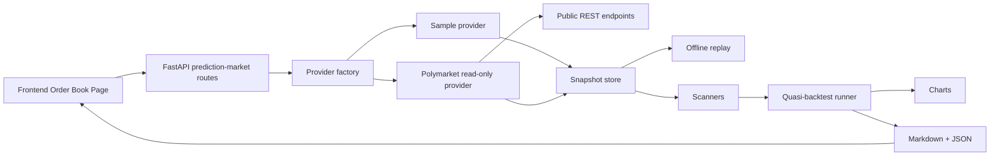

# Phase 11 Design Spec - Polymarket Read-Only Research Extension

## 1. Scope

Phase 11 adds a safe Polymarket research extension to the local AI quant platform.
It supports read-only market discovery, read-only order book ingestion, cached
datasets, scanner/quasi-backtest experiments, charts, reports, backend APIs, and
frontend controls.

This phase is research-only. It does not place orders, sign messages, connect a
wallet, handle private keys, transfer tokens, redeem positions, or claim live
trading readiness.

## 2. Non-Goals

- No live trading.
- No real order submission.
- No wallet connection.
- No private key or API secret handling.
- No on-chain RPC, redemption, or settlement transaction.
- No WebSocket streaming in Phase 11. REST snapshots are enough for reproducible
  research. WebSocket ingestion remains a later phase.
- No high-frequency execution, latency-sensitive strategy, or guaranteed-profit
  claim.

## 3. Current Audit Summary

Existing reusable pieces:

- `src/quant_system/prediction_market/models.py`: event, market, outcome, order
  book, candidate, and proposed trade data models.
- `data/base.py`: provider protocol.
- `data/sample_provider.py`: deterministic sample data.
- `pipeline.py`: scanner execution and dry proposal writing.
- `scanners/`: yes/no and complete-set price consistency scanners.
- `optimizer/greedy_stub.py`: dry proposal optimizer.
- `api/routes/prediction_market.py`: read-only sample endpoints.
- `src/frontend/app/order-book/page.tsx` and `PMRunForm.tsx`: current frontend
  sample workflow.

Missing pieces:

- Real read-only Polymarket REST provider.
- Provider factory for `sample` vs `polymarket`.
- Cache/persistence and offline replay.
- Quasi-backtest result model and runner.
- Charts and report index.
- Frontend provider selection and result/report display.
- Phase 11 docs, troubleshooting, and safety guide.

Do not touch:

- Risk defaults that keep `dry_run`, `paper_trading`, and `kill_switch` safe.
- Agent candidate promotion rules.
- Any live broker, wallet, signing, or order submission surface.
- Existing Phase 0-10 behavior except narrowly extending read-only prediction
  market APIs/UI.

Red flags already present in the working tree:

- `src/quantum-core-algorithmic-trading-platform.zip` is untracked. It should not
  be committed until manually inspected and justified.

## 4. Data Flow



## 5. Backend Boundaries

New or extended backend modules:

- `prediction_market/data/polymarket_readonly.py`: read-only REST provider.
- `prediction_market/provider_factory.py`: safe provider selection.
- `prediction_market/storage.py`: JSONL snapshot persistence and replay.
- `prediction_market/backtest.py`: quasi-backtest runner and metrics.
- `prediction_market/charts.py`: deterministic SVG charts.
- `prediction_market/reporting.py`: extend existing report writer with Phase 11
  summaries.
- `api/routes/prediction_market.py`: add provider selection, fetch/cache,
  backtest/report endpoints.

The provider never exposes submit/sign/send methods. `CLOBOrder` remains a data
model only.

## 6. Frontend Boundaries

Extend only the existing prediction-market page and form:

- `app/order-book/page.tsx`
- `components/forms/PMRunForm.tsx`
- `lib/api.ts` and `lib/apiClient.ts` if response helpers are needed.

UI wording must say read-only research mode. No button may mention trade, submit
order, connect wallet, sign, or redeem.

## 7. Provider Abstraction

Provider choices:

- `sample`: deterministic local provider. Default.
- `polymarket`: real read-only REST provider. Explicit only.
- `replay`: offline dataset provider backed by persisted snapshots. Optional
  when cached data exists.

Implementation note after Phase 11 delivery:

- Real public GET access works in this environment when the request includes a
  normal read-only `User-Agent` header.
- Gamma discovery now uses `/markets/keyset` instead of the deprecated
  `/markets` endpoint.

Selection rules:

- Default: `sample`.
- Request parameter may select `sample` or `polymarket`.
- Unknown provider returns frontend-readable 400.
- `polymarket_api_key` or any credential-like request field returns 400.

## 8. Configuration and Safe Defaults

Config is nested under `Settings.prediction_market` with safe defaults:

| Name | Default | Type | Purpose | Safe behavior |
|---|---:|---|---|---|
| `QS_PREDICTION_MARKET_PROVIDER` | `sample` | string | default provider | no network |
| `QS_POLYMARKET_GAMMA_BASE_URL` | `https://gamma-api.polymarket.com` | string | market discovery | read-only |
| `QS_POLYMARKET_CLOB_BASE_URL` | `https://clob.polymarket.com` | string | order book snapshots | read-only |
| `QS_POLYMARKET_DATA_API_BASE_URL` | `https://data-api.polymarket.com` | string | public trades endpoint | read-only |
| `QS_POLYMARKET_REQUEST_TIMEOUT_SECONDS` | `10` | int | HTTP timeout | fail fast |
| `QS_POLYMARKET_MAX_RETRIES` | `2` | int | transient retries | bounded |
| `QS_POLYMARKET_RATE_LIMIT_PER_SECOND` | `2.0` | float | request pacing | conservative |
| `QS_POLYMARKET_CACHE_DIR` | `data/prediction_market` | path | cache directory | local only |
| `QS_POLYMARKET_CACHE_TTL_SECONDS` | `300` | int | fresh-cache lifetime | reduces duplicate calls |
| `QS_POLYMARKET_CACHE_STALE_IF_ERROR_SECONDS` | `86400` | int | stale fallback window | safer offline replay |
| `QS_POLYMARKET_USER_AGENT` | `ai-quant-platform/phase11` | string | public read-only request identity | avoids ambiguous blocked requests |
| `QS_POLYMARKET_READ_ONLY` | `true` | bool | safety assertion | must remain true |

No config requires secrets.

## 9. Retry, Timeout, and Rate Limit

- Every HTTP request has a timeout.
- Retry only GET requests and only for transient network failures.
- Use a small synchronous sleep between requests to avoid rapid bursts.
- Do not retry invalid schema responses.
- Cache policy is selectable per request: `prefer_cache`, `refresh`,
  `network_only`.
- If the network fails after a successful cache write, the provider may fall
  back to stale cache within the configured safety window.
- Map provider errors to clear HTTP 400/502/504 responses without raw traceback.

## 10. Error Handling

Provider errors are normalized:

- timeout -> `provider_timeout`
- non-2xx response -> `provider_http_error`
- malformed JSON or unexpected schema -> `provider_invalid_response`
- unknown provider -> `unknown_provider`
- credentials in request -> `credentials_not_allowed`

API responses keep the existing safety footer.

## 11. Persistence Strategy

Use JSONL, not Parquet, for Phase 11 prediction-market snapshots because:

- Order books are nested and small.
- JSONL is easy to inspect and replay.
- No extra dependency is required.

Path pattern:

```text
data/prediction_market/http_cache/<resource>/<sha256(url)>.json
data/prediction_market/snapshots/YYYY-MM-DD/<provider>/<market_id>.jsonl
data/prediction_market/reports/<run_id>/
```

Each snapshot record includes:

- `provider`
- `market_id`
- `condition_id`
- `timestamp_utc`
- `fetched_at`
- `source_type`
- `source_endpoint`
- `market`
- `order_books`

## 12. Quasi-Backtest Assumptions

Phase 11 quasi-backtest is not a fill simulator. It evaluates historical or
cached snapshots as if they were independently observed decision points.

Assumptions:

- Prices are best ask snapshots.
- Fill is hypothetical and limited by displayed size.
- No live latency model.
- No guaranteed execution.
- Fees/slippage are configurable conservative deductions.
- Sample/replay history may be sparse and biased.

## 13. Chart Strategy

Use deterministic SVG charts written as files to avoid new heavy dependencies:

- opportunity count over time
- edge histogram
- cumulative estimated edge curve
- parameter sensitivity by min edge threshold

SVG keeps reports browser-readable and testable without matplotlib or plotly.

## 14. API Design

Extend `/api/prediction-market`:

- `GET /api/prediction-market/markets?provider=sample|polymarket&limit=`
- `POST /api/prediction-market/refresh`
- `POST /api/prediction-market/scan`
- `POST /api/prediction-market/dry-arbitrage`
- `POST /api/prediction-market/backtest`
- `GET /api/prediction-market/results/{run_id}`
- `GET /api/prediction-market/results/{run_id}/charts`

All endpoints remain read-only. POST endpoints trigger local research jobs only.

## 15. Frontend Plan

Order Book page changes:

- Provider selector: `sample` / `polymarket`.
- Read-only warning banner.
- Parameters: min edge, max markets, max capital, max legs, fee bps.
- Buttons: fetch markets, scan, run quasi-backtest.
- Display summary metrics and report/chart links.
- Show provider errors plainly.

## 16. Test Strategy

Backend tests:

- provider factory selection
- mocked Polymarket success
- timeout and invalid response
- persistence write/read/replay
- strategy/quasi-backtest metrics
- chart/report output
- API route success/error/safety
- no dangerous routes or credential acceptance

Frontend tests:

- page loads
- provider selector works
- buttons trigger correct local API endpoints
- errors render

All network tests use mocked clients; normal test runs do not call Polymarket.

## 17. Safety Boundaries

The implementation must preserve:

- `dry_run=true`
- `paper_trading=true`
- `live_trading_enabled=false`
- `kill_switch=true`
- `no_live_trade_without_manual_approval=true`

There is no private key, wallet, signing, order placement, redeem, or token
transfer code in Phase 11.

## 18. Known Risks and Mitigations

- Public API changes: isolate parsing in `PolymarketReadOnlyProvider` and cover
  with mocked schema tests.
- Rate limits/geoblocking: expose provider errors and cache sample/replay data.
- Misleading opportunity interpretation: label all results as hypothetical
  research and document assumptions.
- Sparse data: report snapshot count and never show hit rate unless resolution
  data is available.
- Generated artifacts: keep reports under predictable output directories and
  avoid committing large generated runs.
